# S12 Readiness Topology And Acceptance Ledger

Status: CURRENT (2026-08-10)

This is the canonical execution and handoff checklist for the remaining path
from the local S12 readiness work to S13 cleanup. `active_sequence.md` owns the
project-level S-stage pointer; this document owns the detailed R-node topology,
acceptance criteria and evidence ledger. Chat summaries are not status
authority.

## Authority And Reading Order

For a new implementation or review session, read in this order:

1. `AGENTS.md` and `skills/topology-work-planning/SKILL.md`;
2. `docs/governance/active_sequence.md` for the current S-stage;
3. this document for the ready frontier and node checklist;
4. `docs/governance/current_runtime_status.md` for production truth;
5. the focused contract or task document named by the active node.

Fresh source/runtime evidence outranks this ledger when they conflict. Record a
conflict here before continuing; do not silently reinterpret a dependency.

## Status Model

Each node has three independent status dimensions:

| Dimension | Values | Meaning |
|---|---|---|
| Verification | `NOT_STARTED`, `IN_PROGRESS`, `LOCAL_VERIFIED`, `PROD_VERIFIED` | Whether implementation and the stated acceptance checks passed. |
| Review | `NOT_REVIEWED`, `REVIEWED` | Whether an independent exact-delta review accepted the implementation. |
| Delivery | `UNARCHIVED`, `ARCHIVED`, `DEPLOYED` | Whether an immutable Git delivery boundary exists. |

`LOCAL_VERIFIED` never means archived, deployable or production-authorized.
Mark a node delivered only when its evidence names the exact archived SHA.

## Canonical Topology

```mermaid
flowchart TD
    R0["R0 read-only production audit<br/>COMPLETE"] --> R1A["R1A Core/cutover composition<br/>LOCAL_VERIFIED · ARCHIVED · REVIEWED"]
    R1A --> R1B["R1B single Web route<br/>LOCAL_VERIFIED · ARCHIVED · REVIEWED"]
    R1B --> R1B1["R1B.1 private envelope fail-closed<br/>LOCAL_VERIFIED · ARCHIVED · REVIEWED"]
    R1B1 --> RA["Previous candidate archive<br/>aabf9bc · R1A BLOCKED"]
    RA --> RF["R1A-ACK-ORDER repair archive<br/>dfb8b41 · LOCAL_VERIFIED · ARCHIVED"]
    RF --> RI["Independent R1A delta review<br/>CLEAR"]
    RI --> R1C0["Previous R1C archive<br/>e416172 · REVIEW BLOCKED"]
    R1C0 --> R1C["R1C repair 02b8f649<br/>LOCAL_VERIFIED · ARCHIVED · REVIEWED"]
    R1C --> RC["Independent exact-SHA repaired R1C review<br/>CLEAR"]
    RC --> R1D["R1D dependency compatibility decision 4e4f49e<br/>COMPLETE · ARCHIVED"]
    R1D --> R1DL1["R1D-L1 Feishu update command repair af25198<br/>LOCAL_VERIFIED · REVIEWED · ARCHIVED"]
    R1DL1 --> R1DL1R["Independent exact-SHA R1D-L1 review<br/>CLEAR"]
    R1DL1R --> R1E0["Previous R1E c8e5a882<br/>REVIEW BLOCKED"]
    R1E0 --> R1E["R1E repair 493c77aa<br/>LOCAL_VERIFIED · REVIEWED · ARCHIVED"]
    R1E --> R1ER["Independent exact-SHA repaired R1E review<br/>CLEAR"]
    R1ER --> R1F["R1F owner attention policy + proactive delivery<br/>08e3eea8 · LOCAL_VERIFIED · REVIEWED · ARCHIVED"]
    R1F --> R1FR["Independent exact-SHA R1F review<br/>CLEAR"]
    R1FR --> R2["R2 fresh audit + production-copy rehearsal<br/>LOCAL_VERIFIED · REVIEWED · ARCHIVED"]
    R2 --> R3A["R3-A exact-SHA source review<br/>CLEAR except server proofs"]
    R3A --> RG["R3 gate topology repair 2<br/>LOCAL_VERIFIED · REVIEWED · ARCHIVED"]
    RG --> RP["R3-R1B profile delivery repair 790546a3<br/>LOCAL_VERIFIED · REVIEWED · ARCHIVED"]
    RP --> R3B0["First R3-B server proof<br/>FIX_REQUIRED · FAIL-CLOSED"]
    R3B0 --> RR0["Sealed-runtime contract d845e994<br/>SUPERSEDED BEFORE REVIEW"]
    RR0 --> RR["Sealed-probe no-write repair<br/>LOCAL_VERIFIED · NOT_REVIEWED · ARCHIVED"]
    RR --> RRR["Independent exact-SHA repair review<br/>REQUIRED"]
    RRR --> R3B["R3-B immutable server gate + dry-run retry<br/>NOT STARTED"]
    R3B --> OA["Explicit owner production authorization"]
    OA --> S12["S12 Core Cutover Gate"]
    S12 --> OBS["Observation window"]
    OBS --> DA["Separate owner deletion authorization"]
    DA --> S13["S13 legacy cleanup"]
```



Default execution is serial. The independent exact-SHA R1A repair review is
clear, which also releases the already source-review-clear R1B/R1B.1 grouped
status. R1C is archived by the commit containing this ledger, but remains
`REVIEWED` at `02b8f6491f4ca3013f847decdc59974a90bebdca`. The first R1C archive
`e4161721d253c160558aeaf22b7fda77e1a331b4` remains review-blocked and is not
the accepted candidate. R1D has completed the bounded compatibility decision.
It found no required dependency upgrade, but both checked CLI versions require
an update subcommand that the accepted adapter omitted. R1D-L1 adds exactly the
missing command pair and is archived at
`af25198654e048cc70e7e94a4c9974f2070428e0`; its narrow exact-SHA delta review
is clear. R1D dependency compatibility is closed. The first R1E archive
`c8e5a88291bfe7e66a607a753a4994617aab0565` is review-blocked by
`R1E-FACT-PROJECTION-GAP` and `R1E-REVISION-EVIDENCE-SKEW`. The commit containing
the bounded repair is accepted at
`493c77aa90fe53bba8a10fd94dd03136ba51d4eb` after a clear independent
exact-SHA rereview. R1F candidate
`08e3eea81c336ac48f3e0b85a87b0b5c6d445307` also passed independent review.
R2-A and the copy-only R2-B rehearsal are clear; `08e3eea8` is the runtime SHA
that was actually rehearsed. The later governance/evidence-only archive must
not be described as the rehearsed runtime. R2 review is clear. R3-A found
frozen candidate `08ea6b0ccb499bb84ddd4d20a2ebad6a48c1af92` clear except for
server proofs, then follow-up inspection confirmed a stale split-v0.13
immutable-gate contract. Independent review found first repair `d70a08fc` still
blocked on the unproven persistent Full condition and stale v0.13 Python probe.
Bounded repair 2 passed independent exact-SHA review at `d6adb106`. The later
profile-delivery repair passed review at `790546a3`. The first R3-B run proved
the exact candidate YAML semantics and source dry-run, then stopped fail-closed
on stale one-line CLI presentation and flat-runtime import assumptions. The
current review frontier is the class-level sealed-runtime contract repair;
R3-B retry must not start before its independent exact-SHA review.

## Current Frontier

| Node | Verification | Review | Delivery | Dependency | Decision |
|---|---|---|---|---|---|
| R0 | `LOCAL_VERIFIED` | historical review | historical evidence | S11 | Complete; R2-A performed the required fresh reinspection at `2026-08-10T02:14:52Z`. |
| R1A | `LOCAL_VERIFIED` | `REVIEWED` | `ARCHIVED` | R0 | `R1A-ACK-ORDER` blocked `aabf9bc`; the `dfb8b41` repair passed independent exact-SHA delta review. |
| R1B | `LOCAL_VERIFIED` | `REVIEWED` | `ARCHIVED` | R1A | Independent source review is clear; grouped boundary released with R1A. |
| R1B.1 | `LOCAL_VERIFIED` | `REVIEWED` | `ARCHIVED` | R1B + observed ordinary-chat leak | Independent source review is clear; grouped boundary released with R1A. |
| R1C | `LOCAL_VERIFIED` | `REVIEWED` | `ARCHIVED` | R1A/R1B/R1B.1 review closure | `e416172` was review-blocked; repaired archive `02b8f6491f4ca3013f847decdc59974a90bebdca` passed independent exact-SHA review. |
| R1D | `LOCAL_VERIFIED` | `NOT_REVIEWED` | `ARCHIVED` at `4e4f49e3f2f80555ba605308fce909fdfc8302a9` | R1C | Decision complete: all dependencies have an explicit disposition; no dependency changed. |
| R1D-L1 | `LOCAL_VERIFIED` | `REVIEWED` | `ARCHIVED` at `af25198654e048cc70e7e94a4c9974f2070428e0` | R1D | Exact one-line caller-contract repair and both versioned dry-runs passed independent narrow review. |
| R1E | `LOCAL_VERIFIED` | `REVIEWED` | `ARCHIVED` at `493c77aa90fe53bba8a10fd94dd03136ba51d4eb` | R1D-L1 review CLEAR | `c8e5a882` was review-blocked; repaired fact/projection atomicity and exact fact/revision/checkpoint binding passed exact-SHA rereview. |
| R1F | `LOCAL_VERIFIED` | `REVIEWED` | `ARCHIVED` at `08e3eea81c336ac48f3e0b85a87b0b5c6d445307` | R1E review CLEAR | Default timely delivery no longer depends on desktop presence; one existing Core attention-flush schedule owns durable backlog recovery. |
| R2 | `LOCAL_VERIFIED` | `REVIEWED` | `ARCHIVED` by the evidence commit | R1F review CLEAR | Fresh R2-A audit and isolated R2-B rehearsal are clear; runtime rehearsal SHA is `08e3eea8`, distinct from the evidence archive. |
| R3-A | `LOCAL_VERIFIED` | `REVIEWED` except server proofs | `ARCHIVED` at `08ea6b0ccb499bb84ddd4d20a2ebad6a48c1af92` | R2 review CLEAR | Candidate areas were clear, but follow-up source inspection found the stale Hermes release-gate topology blocker. |
| R3-GATE | `LOCAL_VERIFIED` | `REVIEWED` | `ARCHIVED` at `d6adb1061b5a819407582690ca6a9adcb63c8d26` | first repair `d70a08fc` review blocked | Repair 2 proves the governed Full condition block and exact-v0.20 Python probe; independent review is clear. |
| R3-R1B-PROFILE | `LOCAL_VERIFIED` | `REVIEWED` | `ARCHIVED` at `790546a34285a101948e301363381d094ec14b83` | R3-GATE review CLEAR | Exact prior-source/profile-digest contract delivers only `config.companion.yaml` as active plus the inert Pro template; rollback reuses the source transaction snapshot. |
| R3-B-RUNTIME-CONTRACT | `LOCAL_VERIFIED` | `NOT_REVIEWED` | `ARCHIVED` at `d845e994ac256d5d4c2e729eb8dd46224b52b746`; superseded before review | first R3-B stopped fail-closed | One runtime matrix governs semantic version, sealed app/site-packages imports, live process argv/env, local/staged parity and semantic companion YAML. |
| R3-B-NO-WRITE | `LOCAL_VERIFIED` | `NOT_REVIEWED` | `ARCHIVED` by the commit containing this ledger | bytecode-write blocker on d845e994 | Explicit `-B` plus shared self-guard makes every A/B/C sealed-Python validation non-writing; writable-tree fixture proves no path/content/mode drift. |
| R3-B | `NOT_STARTED` | `NOT_REVIEWED` | `UNARCHIVED` | runtime-contract exact-SHA review CLEAR | Retry the real immutable Linux/systemd identity and dry-run proof; the first run's source/profile evidence remains valid but the runtime gate did not pass. |
| S12 | `NOT_STARTED` | not applicable | not applicable | R3 + explicit owner authorization | Production source remains `98fd8b3`; no Core cutover occurred. |

The previous implementation candidate is
`aabf9bc97ea3fcd95bf6d79798c56315543d0c37`; the repair starts from governance
HEAD `6def06aa45a6d4c64b9a4e78cda35dd38331678f`. The replacement candidate is
`dfb8b41df86a65136f3fa5c2cd181fc1f2045ba1`. Production remains at
`98fd8b38eb4bca9caa6f223f990f1bec3ab6cd0d`; an archived local candidate is
not a deployable or production-authorized SHA.

## Node Acceptance Checklists

### R1A — Local Core And Cutover Composition

Purpose: provide the single cutover transaction/interlock, Core lifecycle,
managed wake, WorkRun workers, reminder projection, attention-flush ownership
shape and exact cutover command without touching production.

- [x] Cutover transaction and Journal interlock exist locally.
- [x] Legacy candidates import paused; historical pending delivery is suppressed,
  not replayed.
- [x] Managed-wake and system-schedule manifests are disabled by default.
- [x] Exact cutover verification rejects malformed candidate SHA/time and an
  incomplete visible owner binding before any apply path.
- [x] Node composes Core lifecycle, WorkRun claim/terminal handling and typed
  scheduled delivery without a second executor.
- [x] Timed todo registration and missed-registration repair converge on the
  same replay-safe one-shot schedule.
- [x] Scheduled delivery returns a typed sent/suppressed/ambiguous outcome; the
  worker durably commits and rereads the completed WorkRun before invoking the
  Python reminder acknowledgement.
- [x] Failure after terminal commit but before acknowledgement leaves the
  WorkRun completed; reopen performs no delivery/effect and retries only the
  idempotent missing acknowledgement before recording its Core marker.
- [x] Local project Python has one ignored `.venv` entrypoint; archive and Node
  release tests prefer it while production gates still require an explicit
  absolute `RAN_AGENT_PYTHON_BIN`.
- [x] Existing evidence remains Core/attention `183/183`, affected Python
  `67/67` and `55/55`, complete Node baseline `1337` with four declared skips,
  and Python-entry regressions `4/4`; the blocker repair adds focused Node
  `15/15`, Python acknowledgement `1/1`, and affected Core `180/180`.
- [x] Independent review recorded `R1A-ACK-ORDER` against `aabf9bc`; the
  intentional repair and synchronized governance are archived at
  `dfb8b41df86a65136f3fa5c2cd181fc1f2045ba1`.
- [x] Independent exact-SHA delta review records no blocker against the R1A
  scope.

Do not redo the accepted suites unless relevant source changed or independent
review identifies a concrete gap.

### R1B — One Generic Web Acquisition Route

Focused contract: `docs/governance/s12-r1b-web-routing.md`.

- [x] Default companion surface exposes `mcp-search_hub`, not the built-in
  generic `web` toolset/provider block.
- [x] Social/media readers and the distinct Playwright debugging surface retain
  their existing boundaries.
- [x] Profile template and diagnostics enforce the same assembly truth.
- [x] A DLM-shaped request reaches the real Search Hub MCP handler and returns
  typed research evidence without `web_extract`, `web_search` or
  `tool_describe`.
- [x] Local evidence: affected Node `62/62`, profile/release Python `43/43`,
  shell syntax and `git diff --check` pass.
- [x] Independent source review found no R1B blocker or ordinary-Web capability
  regression; the grouped review status was released when R1A closed.
- [x] R1B is archived with its governance updates under
  `aabf9bc97ea3fcd95bf6d79798c56315543d0c37`.

Completion marker: `LOCAL_VERIFIED + REVIEWED + ARCHIVED`. A live stochastic
production-model call is not required before archive because the duplicate
tool is structurally absent; production verification belongs to S12.

### R1B.1 — Provider-Origin Private Envelope Fail-Closed

Purpose: keep malformed Hermes/Node private protocol out of every owner-visible
ordinary reply. This is a shared provider boundary, not a document action type.

- [x] Reproduce a normal-chat provider reply whose complete private envelope
  uses `schemaVersion: "v1"` and observe the raw JSON leak before the fix.
- [x] Require the producer prompt to emit JSON number `1`, never a string alias.
- [x] Canonicalize only the unambiguous provider-origin aliases `"1"` and
  `"v1"` to version `1`, then run the existing strict envelope normalizer.
- [x] A malformed object with `schemaVersion + message` fails closed to a safe
  bridge reply; it cannot degrade into raw `reply_text`.
- [x] The rejection log contains only a stable error code, not provider content
  or private fields.
- [x] Ordinary requested JSON without the private envelope shape remains
  visible.
- [x] Gateway, reply-envelope, reply-backend, provider-boundary, ChannelHub,
  Node entry and outbound affected tests pass `259/259`.
- [x] Independent source review found no R1B.1 blocker and confirmed the shape
  test is neither fail-open nor an overbroad “contains schemaVersion” regex;
  the grouped review status was released when R1A closed.
- [x] R1B.1 is archived with R1A/R1B under
  `aabf9bc97ea3fcd95bf6d79798c56315543d0c37`.

Completion marker: `LOCAL_VERIFIED + REVIEWED + ARCHIVED`. Production keeps the
old parser until an authorized later deployment.

### R1C — Feishu `document.write` And Truthful Reply

Purpose: model recipes and sources without creating one action type per recipe.
Implement only the missing stable Feishu document effect; do not create a
universal capability framework.

- [x] Define the typed effect as `document.write`, provider `feishu`, operation
  `create|update`, exact target and content reference/hash.
- [x] Keep `document.write` semantics independent of `lark-cli` version and
  response shape; CLI-specific commands, parsing and normalization stay inside
  the Feishu adapter.
- [x] Reuse existing Feishu search/create/fetch/readback primitives and preserve
  the accepted `feishu.minutes_to_doc` path.
- [x] Do not upgrade `lark-cli` in R1C or treat local `1.0.85` as production
  truth; R1D later confirmed the observed production `1.0.66` protocol is
  version-compatible while identifying the separate update-command defect.
- [x] Node validates actor, target, payload identity, idempotency and readback;
  the model cannot self-authorize or claim success.
- [x] A repairable recipe/type mismatch produces one bounded internal
  `needs_replan`; missing authority, unresolved target ambiguity and unknown
  post-dispatch outcome remain hard stops.
- [x] The repair response is not re-entered into the full envelope pipeline:
  it must contain exactly one `document.write`, null activity, and empty
  commitments/claims; any unrelated action or authority-bearing field fails
  closed before execution.
- [x] Preserve the R1B.1 invariant that private envelopes never appear as
  owner-visible JSON while adding action result acknowledgements.
- [x] Owner acknowledgement distinguishes pre-execution rejection, execution
  failure, ambiguous outcome and readback failure instead of calling all of
  them “readback not confirmed”.
- [x] One synthetic `Web source -> learning note -> exact Feishu document`
  chain proves the exact returned document ID, exact resolved parent membership,
  canonical requested body and durable terminal receipt. Update reads the exact
  supplied document ID and verifies its canonical body.
- [x] Replay/reopen produces no duplicate document effect; changed content under
  the same source-message causation is rejected instead of rewritten.
- [x] Adversarial repair activity and unrelated-action regressions execute zero
  escaped effects; correct-title/wrong-body and correct-body/wrong-parent both
  fail readback; exact document/body/parent succeeds.
- [x] Existing Minutes and private-envelope boundaries remain green. The final
  focused R1C/reply set passes `75/75`, and the smallest shared
  envelope/receipt/ledger boundary set passes `125/125`.
- [x] The host-local test entry resolves the bundled Node `24.14.0`, and the
  affected Python test resolves explicit `RAN_AGENT_PYTHON_BIN` or the project
  `.venv`; production keeps explicit runtime executable inputs.
- [x] Touched JavaScript syntax checks, the governance document inventory and
  `git diff --check` pass.
- [x] The repository archive transaction containing this ledger creates the
  exact immutable R1C candidate and pushes it to `origin/main`.
- [x] Independent exact-SHA R1C review is clear for
  `02b8f6491f4ca3013f847decdc59974a90bebdca`.

The first R1C archive `e4161721d253c160558aeaf22b7fda77e1a331b4` is blocked by
`R1C-REPLAN-AUTHORITY-ESCAPE` and `R1C-READBACK-EVIDENCE`. The commit containing
this ledger is their bounded repair. Accepted marker:
`LOCAL_VERIFIED + REVIEWED + ARCHIVED` at
`02b8f6491f4ca3013f847decdc59974a90bebdca`.
R1D records the compatibility decision without reopening R1C or changing a
dependency. R1C cannot claim production-candidate readiness until the separate
R1D-L1 caller-contract repair is authorized, implemented, reviewed and
archived.

### R1D — Bounded Dependency Compatibility Decision

Purpose: turn dependency versions into explicit candidate decisions, not an
implicit upgrade backlog.

- [x] Record production version, candidate version, required protocol surface,
  failure behavior and rollback for `lark-cli`, Ombre and external-MCP runtime
  dependencies.
- [x] Classify each dependency `BLOCKS_S12` or `POST_CUTOVER_OK` with a reason.
- [x] For `lark-cli`, verify the exact commands and JSON/readback shapes used by
  R1C against server `1.0.66` and candidate `1.0.85` where needed.
- [x] R1D—not R1C—decides whether `lark-cli` stays compatible, requires a
  separate reversible upgrade, or is post-cutover-safe.
- [x] Determine that S8 projection is not composed by S12; therefore do not
  mutate Ombre or run unnecessary write-tool smokes. Production loopback health
  remains HTTP 200.
- [x] Record the full Ombre tool smoke as not applicable to S12 because the
  projector is not composed; retain it for a future composed provider change.
- [x] Verify External MCP Gateway retains the stable host boundary; no external
  server gains direct presentation authority.
- [x] Record the decision in governance and archive the evidence/changes under
  an exact SHA.

Completion marker: every dependency has one recorded disposition; no optional
provider refactor is pulled into the cutover.

Decision: `lark-cli` is `COMPATIBLE_AS_IS`, but its caller contract
`docs +update --command overwrite` required R1D-L1; External MCP is compatible
but remains blocked on R1E readiness acceptance. Ombre provider changes and
Agent Reach feasibility are `POST_CUTOVER_OK`. No dependency was upgraded.

### R1D-L1 — Feishu Update Command Contract Repair

Purpose: repair only the missing mandatory update argument discovered by R1D;
do not reopen `document.write` semantics or upgrade the provider.

- [x] The adapter emits exactly one `--command overwrite` pair for update.
- [x] Update and subsequent fetch keep the exact supplied document ID.
- [x] Exact canonical-body readback remains required for success.
- [x] Create behavior is unchanged.
- [x] Unknown post-dispatch outcome remains durable ambiguous/no-resend.
- [x] The focused create/update/readback/replay/ambiguity set passes `6/6`.
- [x] Fake-token dry-runs on production CLI `1.0.66` and isolated `1.0.85`
  both resolve to PUT, `command=overwrite` and the supplied document ID without
  an external write.
- [x] No dependency, R1A/R1B/R1B.1 behavior, R1E, S12 or production state
  changed.
- [x] Archive the bounded source/test/governance delta under one exact SHA.
- [x] Independent exact-SHA R1D-L1 delta review is clear for
  `af25198654e048cc70e7e94a4c9974f2070428e0`.

Completion marker: `LOCAL_VERIFIED + REVIEWED + ARCHIVED`. R1D dependency
compatibility is closed; repaired R1E is accepted at
`493c77aa90fe53bba8a10fd94dd03136ba51d4eb`.

### R1E — External MCP Poll Through WorkRun Authority

Purpose: connect external forum/RSS/other MCP activity without creating a
second fact authority or allowing the provider to send directly to the owner.

- [x] Extend S10's accepted `external_poll` fact-only seam; do not introduce a
  second external-fact writer.
- [x] A claimed WorkRun validates schedule, revision, fence/lease and exact
  external-poll payload before provider execution.
- [x] Provider output is sanitized and recorded as one hash-bound Core fact.
- [x] Duplicate tick, restart and replay do not duplicate the fact or provider
  effect.
- [x] Paused/disabled external activities remain inert.
- [x] Owner-visible notification, when warranted, follows
  `Core fact -> Hermes decision -> Node attention valve -> presentation outbox
  -> adapter receipt`.
- [x] Tests prove the external MCP/provider has no direct message-send surface.
- [x] Record first archive `c8e5a88291bfe7e66a607a753a4994617aab0565`
  as blocked by `R1E-FACT-PROJECTION-GAP` and
  `R1E-REVISION-EVIDENCE-SKEW`.
- [x] Fact commit atomically reserves one deterministic Core projection;
  restart resumes attention/schedule projection without provider replay.
- [x] Notification payload and evidence bind exact Activity ID/revision,
  checkpoint digest and Core fact; later revision/digest mismatch suppresses.
- [x] Fresh focused repair `18/18`, shared affected `52/52`, syntax and diff
  checks pass; the bounded repaired candidate is archived.
- [x] Independent exact-SHA repaired review is clear for
  `493c77aa90fe53bba8a10fd94dd03136ba51d4eb`.

### R1F — Owner Attention Policy And Proactive Delivery

Purpose: let a worthy proactive fact reach the owner without a desktop-presence
feed while preserving durable suppression/coalescing for policies that actually
require delay.

- [x] The active S12 composition uses the existing attention valve without a
  desktop presence provider; ordinary timely content is eligible by default.
- [x] Ambient content remains silent. Synthetic focused/gaming/busy/dnd/unknown
  states delay ordinary timely content without becoming production telemetry.
- [x] Stable fingerprints coalesce; arrivals during flush survive stale
  confirmation; interrupted flushes recover to pending after reopen.
- [x] The existing managed Core manifest contains exactly one
  `system-task:attention-flush` producer, and repeated flush executions do not
  duplicate notification schedules.
- [x] A synthetic external fact reaches attention admission, a replay-safe
  notification schedule, Hermes decision and typed presentation receipt without
  `presence.json`, a desktop reporter, a presence endpoint or a real send.
- [x] Hermes game activity no longer infers owner gaming. Desktop presence and
  explicit owner DND remain `POST_CUTOVER_OK`; Telegram is future channel work.
- [x] Focused and smallest affected tests pass `60/60`; syntax, diff and
  governance checks pass. The bounded candidate is archived.
- [x] Independent exact-SHA R1F review is clear for
  `08e3eea81c336ac48f3e0b85a87b0b5c6d445307`.

### R2 — Fresh Production-Copy Rehearsal

- [x] Re-read current production source, services, clocks and aggregate state;
  do not reuse the 2026-08-08 counts as cutover truth.
- [x] Snapshot/copy production state through the governed reversible procedure.
- [x] Run exact candidate `08e3eea8` migration/cutover rehearsal on the copy only.
- [x] Every imported reminder/activity candidate starts paused.
- [x] Historical `ambiguous` rows become receipt/no-resend evidence only.
- [x] The historical pending outbound item is suppressed/reconciled, never
  delivered.
- [x] Watermarks, counts, hashes and schedule dispositions reconcile.
- [x] Duplicate/missed ticks, crash/restart and adapter ambiguity use synthetic,
  non-delivering targets.
- [x] Record exact candidate SHA, fresh counts and rehearsal result; archive the
  evidence without changing production.

The redacted aggregate evidence is
`docs/governance/r2_fresh_production_copy_rehearsal.v1.json`. The first apply
used an unsupported pure `synthetic` platform and failed before commit with
zero Journal, Activity and Schedule rows; the valid Feishu protocol identity
with a synthetic non-delivering destination then succeeded. This is
`NON_BLOCKING_OPERATING_INPUT_CORRECTION`, not a source defect. R2 caused no
production mutation. The separately authorized XHS public-only runtime
recovery is recorded independently and leaves
`XHS_PUBLIC_NETWORK_SMOKE_PENDING_R3`.

### R3 — Immutable Candidate Review And Dry-Run

- [x] Confirm the frozen candidate is the governance-only R2 evidence
  archive descended from rehearsed runtime `08e3eea8`; do not claim that R2-B
  rehearsed the later archive SHA.
- [x] R3-A independent review was clear except server proofs; preserve that
  evidence rather than repeating the review.
- [x] Record blocker `R3-GATE-HERMES-TOPOLOGY-STALE`: frozen candidate
  `08ea6b0c` still required both Lite and retired Full executables, equality,
  Hermes v0.13 and its obsolete adjacent-Python layout.
- [x] First repair resolved the single active managed
  `ran-agent-hermes.service` executable, exact v0.20.0 contract, sealed matching
  Python/imports, runtime identity and process interpreter, but its independent
  review returned `R3-GATE-HERMES-TOPOLOGY-STALE = NOT_RESOLVED` because
  `R3-GATE-FULL-CONDITION-BLOCK-UNPROVEN` and
  `R3-GATE-PYTHON-PROBE-STALE` remained.
- [x] Repair 2 derives the governed Full drop-in, proves the effective missing
  condition target and rejects absent/wrong/neutralized blocks without a Full
  executable; the Python provider probe now requires exact v0.20 and explicit
  import-capable runtime Python without obsolete `Project:` semantics.
- [x] Local focused resolver/gate checks pass `2/2`, focused Python checks pass
  `4/4`, and the affected release/portability file reports 83 total tests: 80
  pass and three unchanged Linux root-only skips.
- [x] Independent exact-SHA review of bounded gate repair 2 reports `CLEAR` at
  `d6adb1061b5a819407582690ca6a9adcb63c8d26`.
- [x] Confirm `R3-R1B-PROFILE-DELIVERY-GAP`: source validation rejected R1B's
  companion delta and activation still selected legacy `config.yaml`.
- [x] Bind the exact prior source, companion digest, allowed two-file profile
  delta and existing live destinations in one governed migration contract.
- [x] Activate `config.companion.yaml`, keep the Pro template inert, preserve
  Search Hub/Playwright and reject the built-in web surface.
- [x] Reuse the source transaction snapshot so rollback restores the prior
  profiles and source pointer together.
- [x] Independent exact-SHA review of the profile-delivery repair reports
  `CLEAR` at `790546a34285a101948e301363381d094ec14b83`.
- [x] Record the first R3-B attempt as `FIX_REQUIRED / STOPPED FAIL-CLOSED`:
  exact candidate R1B YAML semantics and source dry-run passed; root resolver
  rejected stale one-line CLI and flat-runtime import assumptions; non-root
  did not run; production post-check was unchanged.
- [x] Replace all immutable/local A/B/C version and import consumers with one
  sealed v0.20 runtime contract and reject semantic YAML variants that restore
  the built-in `web` capability.
- [x] Resolve `R3-GATE-SEALED-PROBE-BYTECODE-WRITE-RISK`: every direct A/B/C
  sealed-Python import uses explicit `-B`, the shared probe rejects omission
  before imports, and the writable fixture has identical before/after trees.
- [ ] Independent exact-SHA review of the sealed-runtime contract repair is
  `CLEAR`.
- [ ] Immutable gate succeeds from Git-less read-only copies under required
  root/non-root and isolated-environment seams.
- [ ] Exact-SHA server dry-run proves capacity, identities, manifests, rollback,
  one managed clock projection and no production mutation.
- [ ] Fresh production diff and migration reconciliation show no unexplained
  writer, schedule or outbox state.
- [ ] S12 remains `NOT_STARTED` after dry-run; request explicit owner production
  authorization with the exact SHA and summarized mutation.

The local runtime-contract repair does not impersonate a real Linux
systemd/`ubuntu:ubuntu` or service-managed v0.20 `--all` pass. The R3-B retry
remains exclusively server-side and is `NOT_STARTED`.

The former local Hermes/Python binding and wrong-group missing proofs are
closed by the shared runtime probe and focused negative. Real Linux
`ubuntu:ubuntu`/systemd/proc behavior remains R3-B. The v0.13/dual-runtime
`diagnose-hermes-provider-boundary.sh` is a `NON_BLOCKING_STALE_DIAGNOSTIC`;
it is not called by the immutable release gate or S12 execution authority.

### S12 — Core Cutover Gate

This node is blocked until R3 and explicit owner production authorization.

- [ ] Stop new ingress and drain/reconcile legacy effect/outbox state.
- [ ] Execute the one authorized Core cutover transaction against the exact SHA.
- [ ] Enable exactly one managed work-producing tick and disable legacy visible
  wake.
- [ ] Prove cutover Journal interlock, Core writer/schema health and
  watermark/hash/count reconciliation.
- [ ] Send exactly one allowlisted synthetic Feishu message and record one
  durable terminal receipt.
- [ ] Record deployment and bounded immediate production verification; do not
  start S13 cleanup.

### S13 — Observation And Cleanup

- [ ] Observe at least the governed window with one restart and duplicate/missed
  synthetic tick probe, zero duplicate delivery and no ambiguous auto-retry.
- [ ] Reconcile managed schedules, WorkRuns, outbox receipts and legacy clocks.
- [ ] Obtain separate owner authorization for deletion/retirement.
- [ ] Remove only the named legacy scheduler, JSON outbox and compatibility
  writers after recovery requirements expire.
- [ ] Update runtime truth, topology and cleanup record; remove obsolete
  worktrees/coordination state after archival integration.

## Reviewer Handoff Template

Every new Codex/Kimi/review session should finish with this exact information:

```text
Node reviewed:
Starting HEAD / worktree base:
Production source (read-only fact):
Files changed for this node:
Dependency checks:
Acceptance checklist: PASS / FAIL per item
Focused test command and count:
Affected full-suite command and count:
Adversarial findings: BLOCKER / NON_BLOCKING / NONE
Verification status:
Delivery status and archived SHA:
Next ready node:
Production changed: NO / YES (authorization reference)
```

Do not accept a narrative “done” report without the checklist, exact evidence
and status split above.

The independent R1A, R1C, R1D-L1, repaired R1E, R1F and R2 reviews are already
clear and must not be repeated. The next review is a narrow exact-SHA delta
review of the R3 gate repair only:

```text
Start from blocked frozen candidate
`08ea6b0ccb499bb84ddd4d20a2ebad6a48c1af92` and review only its delta to the
new R3 gate-repair archive. Confirm the immutable gate now derives one unified
Hermes v0.20.0 runtime from the existing mutation/artifact contracts and
`ran-agent-hermes.service`; requires exact managed executable, sealed matching
Python/imports, service identity and process interpreter; rejects v0.13,
arbitrary user binaries and mismatched paths; and treats
`ran-agent-hermes-full.service` only as an inactive/disabled negative topology
invariant. Confirm provider-boundary fixtures no longer preserve a hidden split
or v0.13 success path. Preserve the declared three Linux root-only skips and
verify no Core/runtime product behavior changed. Do not run R3-B, access
production or start S12. Report CLEAR or exact blockers and the reviewed SHA.
```

## Update Protocol

- Update this ledger, `active_sequence.md`, `current_runtime_status.md` and any
  focused contract in the same archive that advances a node.
- Keep exactly one implementation node active. Independent review of the same
  node is its delivery boundary, not a second implementation frontier.
- Recompute the ready frontier after every review/archive. Stop if evidence
  fails, dependencies changed or a required authorization is absent.
- Do not retain completed work in extra worktrees. Merge/archive the bounded
  node, then remove its temporary coordination state when recovery no longer
  requires it.
