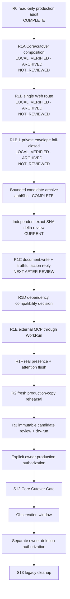

# S12 Readiness Topology And Acceptance Ledger

Status: CURRENT (2026-08-09)

This is the canonical execution and handoff checklist for the remaining path
from the local S12 readiness work to S13 cleanup. `active_sequence.md` owns the
project-level S-stage pointer; this document owns the detailed R-node topology,
acceptance criteria and evidence ledger. Chat summaries are not status
authority.

## Authority And Reading Order

For a new implementation or review session, read in this order:

1. `AGENTS.md` and `skills/topology-work-planning/SKILL.md`;
2. `docs/governance/active_sequence.md` for the current S-stage;
3. this document for the ready frontier and node checklist;
4. `docs/governance/current_runtime_status.md` for production truth;
5. the focused contract or task document named by the active node.

Fresh source/runtime evidence outranks this ledger when they conflict. Record a
conflict here before continuing; do not silently reinterpret a dependency.

## Status Model

Each node has three independent status dimensions:

| Dimension | Values | Meaning |
|---|---|---|
| Verification | `NOT_STARTED`, `IN_PROGRESS`, `LOCAL_VERIFIED`, `PROD_VERIFIED` | Whether implementation and the stated acceptance checks passed. |
| Review | `NOT_REVIEWED`, `REVIEWED` | Whether an independent exact-delta review accepted the implementation. |
| Delivery | `UNARCHIVED`, `ARCHIVED`, `DEPLOYED` | Whether an immutable Git delivery boundary exists. |

`LOCAL_VERIFIED` never means archived, deployable or production-authorized.
Mark a node delivered only when its evidence names the exact archived SHA.

## Canonical Topology



Default execution is serial. Do not start a dependent node merely because some
of its code already exists. R1C may be implemented before the R1D decision, but
it cannot become a production candidate until R1D accepts the exact Feishu
provider contract.

## Current Frontier

| Node | Verification | Review | Delivery | Dependency | Decision |
|---|---|---|---|---|---|
| R0 | `LOCAL_VERIFIED` | historical review | historical evidence | S11 | Complete; re-inspect only when R2 starts. |
| R1A | `LOCAL_VERIFIED` | `NOT_REVIEWED` | `ARCHIVED` | R0 | Candidate `aabf9bc`; current exact-SHA review scope. |
| R1B | `LOCAL_VERIFIED` | `NOT_REVIEWED` | `ARCHIVED` | R1A | Candidate `aabf9bc`; current exact-SHA review scope. |
| R1B.1 | `LOCAL_VERIFIED` | `NOT_REVIEWED` | `ARCHIVED` | R1B + observed ordinary-chat leak | Candidate `aabf9bc`; current exact-SHA review scope. |
| R1C | `NOT_STARTED` | `NOT_REVIEWED` | `UNARCHIVED` | R1A/R1B/R1B.1 archived and independently reviewed | Next implementation node after review. |
| R1D | `NOT_STARTED` | `NOT_REVIEWED` | `UNARCHIVED` | R1C | Not ready. |
| R1E | `NOT_STARTED` | `NOT_REVIEWED` | `UNARCHIVED` | R1D | Early local composition exists; accept it only when this node becomes ready. |
| R1F–R3 | `NOT_STARTED` | `NOT_REVIEWED` | `UNARCHIVED` | topology below | Not ready. |
| S12 | `NOT_STARTED` | not applicable | not applicable | R3 + explicit owner authorization | Production unchanged. |

The review baseline is `cacc8924b7e2b67e300a67228a6891576759f555` and the
archived candidate is `aabf9bc97ea3fcd95bf6d79798c56315543d0c37`.
Production remains at `98fd8b38eb4bca9caa6f223f990f1bec3ab6cd0d`; an
archived local candidate is not a deployable or production-authorized SHA.

## Node Acceptance Checklists

### R1A — Local Core And Cutover Composition

Purpose: provide the single cutover transaction/interlock, Core lifecycle,
managed wake, WorkRun workers, reminder projection, attention-flush ownership
shape and exact cutover command without touching production.

- [x] Cutover transaction and Journal interlock exist locally.
- [x] Legacy candidates import paused; historical pending delivery is suppressed,
  not replayed.
- [x] Managed-wake and system-schedule manifests are disabled by default.
- [x] Exact cutover verification rejects malformed candidate SHA/time and an
  incomplete visible owner binding before any apply path.
- [x] Node composes Core lifecycle, WorkRun claim/terminal handling and typed
  scheduled delivery without a second executor.
- [x] Timed todo registration and missed-registration repair converge on the
  same replay-safe one-shot schedule.
- [x] Reminder projection is acknowledged only after durable send/suppress
  terminal evidence.
- [x] Local project Python has one ignored `.venv` entrypoint; archive and Node
  release tests prefer it while production gates still require an explicit
  absolute `RAN_AGENT_PYTHON_BIN`.
- [x] Local evidence: Core/attention `183/183`, earlier affected Python `67/67`,
  current affected Python `55/55`, complete Node baseline `1337` pass with four
  declared environment skips, and Python-entry regressions `4/4`.
- [x] Intentional R1A files and synchronized governance are archived under
  `aabf9bc97ea3fcd95bf6d79798c56315543d0c37`.
- [ ] Independent exact-SHA delta review records no blocker against the R1A
  scope.

Do not redo the accepted suites unless relevant source changed or independent
review identifies a concrete gap.

### R1B — One Generic Web Acquisition Route

Focused contract: `docs/governance/s12-r1b-web-routing.md`.

- [x] Default companion surface exposes `mcp-search_hub`, not the built-in
  generic `web` toolset/provider block.
- [x] Social/media readers and the distinct Playwright debugging surface retain
  their existing boundaries.
- [x] Profile template and diagnostics enforce the same assembly truth.
- [x] A DLM-shaped request reaches the real Search Hub MCP handler and returns
  typed research evidence without `web_extract`, `web_search` or
  `tool_describe`.
- [x] Local evidence: affected Node `62/62`, profile/release Python `43/43`,
  shell syntax and `git diff --check` pass.
- [ ] Independent review verifies the source delta and confirms no ordinary-Web
  capability regression.
- [x] R1B is archived with its governance updates under
  `aabf9bc97ea3fcd95bf6d79798c56315543d0c37`.

Completion marker: `LOCAL_VERIFIED + REVIEWED + ARCHIVED`. A live stochastic
production-model call is not required before archive because the duplicate
tool is structurally absent; production verification belongs to S12.

### R1B.1 — Provider-Origin Private Envelope Fail-Closed

Purpose: keep malformed Hermes/Node private protocol out of every owner-visible
ordinary reply. This is a shared provider boundary, not a document action type.

- [x] Reproduce a normal-chat provider reply whose complete private envelope
  uses `schemaVersion: "v1"` and observe the raw JSON leak before the fix.
- [x] Require the producer prompt to emit JSON number `1`, never a string alias.
- [x] Canonicalize only the unambiguous provider-origin aliases `"1"` and
  `"v1"` to version `1`, then run the existing strict envelope normalizer.
- [x] A malformed object with `schemaVersion + message` fails closed to a safe
  bridge reply; it cannot degrade into raw `reply_text`.
- [x] The rejection log contains only a stable error code, not provider content
  or private fields.
- [x] Ordinary requested JSON without the private envelope shape remains
  visible.
- [x] Gateway, reply-envelope, reply-backend, provider-boundary, ChannelHub,
  Node entry and outbound affected tests pass `259/259`.
- [ ] Independent review confirms the shape test is neither fail-open nor an
  overbroad “contains schemaVersion” regex.
- [x] R1B.1 is archived with R1A/R1B under
  `aabf9bc97ea3fcd95bf6d79798c56315543d0c37`.

Completion marker: `LOCAL_VERIFIED + REVIEWED + ARCHIVED`. Production keeps the
old parser until an authorized later deployment.

### R1C — Feishu `document.write` And Truthful Reply

Purpose: model recipes and sources without creating one action type per recipe.
Implement only the missing stable Feishu document effect; do not create a
universal capability framework.

- [ ] Define the typed effect as `document.write`, provider `feishu`, operation
  `create|update`, exact target and content reference/hash.
- [ ] Reuse existing Feishu search/create/fetch/readback primitives and preserve
  the accepted `feishu.minutes_to_doc` path.
- [ ] Node validates actor, target, payload identity, idempotency and readback;
  the model cannot self-authorize or claim success.
- [ ] A repairable recipe/type mismatch produces one bounded internal
  `needs_replan`; missing authority, unresolved target ambiguity and unknown
  post-dispatch outcome remain hard stops.
- [ ] Preserve the R1B.1 invariant that private envelopes never appear as
  owner-visible JSON while adding action result acknowledgements.
- [ ] Owner acknowledgement distinguishes pre-execution rejection, execution
  failure, ambiguous outcome and readback failure instead of calling all of
  them “readback not confirmed”.
- [ ] One synthetic `Web source -> learning note -> exact Feishu document`
  chain proves document ID, parent folder, bounded content, readback and durable
  terminal receipt.
- [ ] Replay/reopen produces no duplicate document effect.
- [ ] Existing ordinary Turn and Minutes regressions remain green; affected
  Node/Core suites and `git diff --check` pass.
- [ ] Independent review is clear and the node is archived under an exact SHA.

Completion marker: local archive may precede R1D, but production-candidate
acceptance remains conditional on R1D's Feishu compatibility decision.

### R1D — Bounded Dependency Compatibility Decision

Purpose: turn dependency versions into explicit candidate decisions, not an
implicit upgrade backlog.

- [ ] Record production version, candidate version, required protocol surface,
  failure behavior and rollback for `lark-cli`, Ombre and external-MCP runtime
  dependencies.
- [ ] Classify each dependency `BLOCKS_S12` or `POST_CUTOVER_OK` with a reason.
- [ ] For `lark-cli`, verify the exact commands and JSON/readback shapes used by
  R1C against server `1.0.66` and candidate `1.0.85` where needed.
- [ ] Upgrade `lark-cli` only if R1C requires the newer contract; keep the
  version change independent and reversible.
- [ ] If S8 projection is composed by S12, smoke Ombre `breath_advanced`,
  `hold`, `grow`, `trace`, response shape and marker reconciliation.
- [ ] Verify External MCP Gateway retains the stable host boundary; no external
  server gains direct presentation authority.
- [ ] Record the decision in governance and archive the evidence/changes under
  an exact SHA.

Completion marker: every dependency has one recorded disposition; no optional
provider refactor is pulled into the cutover.

### R1E — External MCP Poll Through WorkRun Authority

Purpose: connect external forum/RSS/other MCP activity without creating a
second fact authority or allowing the provider to send directly to the owner.

- [ ] Extend S10's accepted `external_poll` fact-only seam; do not introduce a
  second external-fact writer.
- [ ] A claimed WorkRun validates schedule, revision, fence/lease and exact
  external-poll payload before provider execution.
- [ ] Provider output is sanitized and recorded as one hash-bound Core fact.
- [ ] Duplicate tick, restart and replay do not duplicate the fact or provider
  effect.
- [ ] Paused/disabled external activities remain inert.
- [ ] Owner-visible notification, when warranted, follows
  `Core fact -> Hermes decision -> Node attention valve -> presentation outbox
  -> adapter receipt`.
- [ ] Tests prove the external MCP/provider has no direct message-send surface.
- [ ] Focused and affected full suites pass; independent review and archive are
  complete.

### R1F — Real Presence And Attention Admission/Flush

Purpose: prevent both disruptive interruptions and indefinite suppression with
one real, coarse, expiring presence source.

- [ ] One producer supplies only `available`, `gaming`, `focused`, `busy` or
  `dnd` plus freshness; raw window titles are unnecessary.
- [ ] Missing, malformed or stale state becomes `unknown`, never guessed
  `available`.
- [ ] One owner composes attention admission and backlog flush; no second
  visible notification clock is created.
- [ ] Gaming/focused/busy/dnd/unknown delay ordinary timely items; ambient stays
  silent; allowlisted critical and explicit owner reminders retain bypass.
- [ ] Equivalent fingerprints coalesce across quiet-to-available transition and
  restart; facts arriving during flush are not lost or duplicated.
- [ ] Available presence eventually flushes eligible backlog once.
- [ ] Tests use synthetic state and targets; no production desktop probing or
  real delivery occurs.
- [ ] Focused and affected full suites pass; independent review and archive are
  complete.

### R2 — Fresh Production-Copy Rehearsal

- [ ] Re-read current production source, services, clocks and aggregate state;
  do not reuse the 2026-08-08 counts as cutover truth.
- [ ] Snapshot/copy production state through the governed reversible procedure.
- [ ] Run the exact candidate migration/cutover rehearsal on the copy only.
- [ ] Every imported reminder/activity candidate starts paused.
- [ ] Historical `ambiguous` rows become receipt/no-resend evidence only.
- [ ] The historical pending outbound item is suppressed/reconciled, never
  delivered.
- [ ] Watermarks, counts, hashes and schedule dispositions reconcile.
- [ ] Duplicate/missed ticks, crash/restart and adapter ambiguity use synthetic,
  non-delivering targets.
- [ ] Record exact candidate SHA, fresh counts and rehearsal result; archive the
  evidence without changing production.

### R3 — Immutable Candidate Review And Dry-Run

- [ ] All R1/R2 nodes point to one immutable archived candidate SHA.
- [ ] Independent adversarial review reports `CLEAR` or all findings are closed.
- [ ] Required Core, Node, Python and release portability suites pass against
  the exact candidate.
- [ ] Immutable gate succeeds from Git-less read-only copies under required
  root/non-root and isolated-environment seams.
- [ ] Exact-SHA server dry-run proves capacity, identities, manifests, rollback,
  one managed clock projection and no production mutation.
- [ ] Fresh production diff and migration reconciliation show no unexplained
  writer, schedule or outbox state.
- [ ] S12 remains `NOT_STARTED` after dry-run; request explicit owner production
  authorization with the exact SHA and summarized mutation.

### S12 — Core Cutover Gate

This node is blocked until R3 and explicit owner production authorization.

- [ ] Stop new ingress and drain/reconcile legacy effect/outbox state.
- [ ] Execute the one authorized Core cutover transaction against the exact SHA.
- [ ] Enable exactly one managed work-producing tick and disable legacy visible
  wake.
- [ ] Prove cutover Journal interlock, Core writer/schema health and
  watermark/hash/count reconciliation.
- [ ] Send exactly one allowlisted synthetic Feishu message and record one
  durable terminal receipt.
- [ ] Record deployment and bounded immediate production verification; do not
  start S13 cleanup.

### S13 — Observation And Cleanup

- [ ] Observe at least the governed window with one restart and duplicate/missed
  synthetic tick probe, zero duplicate delivery and no ambiguous auto-retry.
- [ ] Reconcile managed schedules, WorkRuns, outbox receipts and legacy clocks.
- [ ] Obtain separate owner authorization for deletion/retirement.
- [ ] Remove only the named legacy scheduler, JSON outbox and compatibility
  writers after recovery requirements expire.
- [ ] Update runtime truth, topology and cleanup record; remove obsolete
  worktrees/coordination state after archival integration.

## Reviewer Handoff Template

Every new Codex/Kimi/review session should finish with this exact information:

```text
Node reviewed:
Starting HEAD / worktree base:
Production source (read-only fact):
Files changed for this node:
Dependency checks:
Acceptance checklist: PASS / FAIL per item
Focused test command and count:
Affected full-suite command and count:
Adversarial findings: BLOCKER / NON_BLOCKING / NONE
Verification status:
Delivery status and archived SHA:
Next ready node:
Production changed: NO / YES (authorization reference)
```

Do not accept a narrative “done” report without the checklist, exact evidence
and status split above.

The current independent review session can start from this instruction:

```text
Read AGENTS.md, docs/governance/active_sequence.md,
docs/governance/s12-readiness-topology.md and
docs/governance/current_runtime_status.md. Audit only the exact archived R1A and
R1B/R1B.1 delta from cacc8924b7e2b67e300a67228a6891576759f555 through
aabf9bc97ea3fcd95bf6d79798c56315543d0c37. Verify every
R1A/R1B/R1B.1 checklist item against source and fresh evidence; distinguish
implementation verification from independent review and archive state. Reproduce
the pre-fix `schemaVersion: "v1"` leak mentally or from the test, then verify
canonical alias handling, malformed-private fail-closed behavior, ordinary JSON
non-regression and sanitized logging. Do not deploy, touch production, start
R1C, or broaden the scope. Report blockers, non-blocking findings, exact
tests/counts, whether R1A/R1B/R1B.1 may be marked REVIEWED, and the next ready node
using the Reviewer Handoff Template.
```

## Update Protocol

- Update this ledger, `active_sequence.md`, `current_runtime_status.md` and any
  focused contract in the same archive that advances a node.
- Keep exactly one implementation node active. Independent review of the same
  node is its delivery boundary, not a second implementation frontier.
- Recompute the ready frontier after every review/archive. Stop if evidence
  fails, dependencies changed or a required authorization is absent.
- Do not retain completed work in extra worktrees. Merge/archive the bounded
  node, then remove its temporary coordination state when recovery no longer
  requires it.
