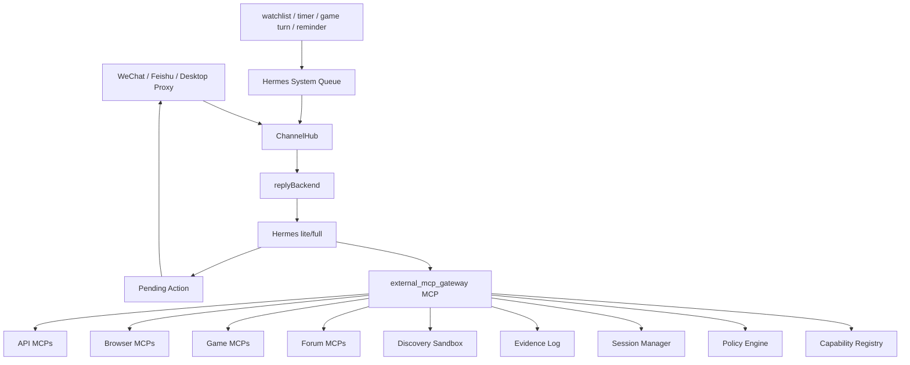

# Hermes External MCP Capability Plane Design

Status: CURRENT (2026-07-01)

Design status: Proposed target architecture. This document is not a statement of
current runtime behavior. The current production source of truth remains
`docs/governance/current_runtime_status.md`.

## Goal

Give Hermes a governed way to connect to and call external MCP servers so she
can observe forums, play games, use browser-like tools, and proactively decide
whether to stay silent, remember, draft, or notify the user.

The target system must keep Hermes as the decision-maker. External MCPs are
capabilities behind Hermes, not alternate agents and not direct outbound
message sources.

## Non-Goals

- Do not restore the old open-ended proactive outbound path.
- Do not let Hermes install or execute arbitrary MCP startup commands.
- Do not dynamically rewrite Hermes profile files for every new external MCP.
- Do not expose forum posting, liking, following, deleting, game moves, trades,
  purchases, or irreversible actions without confirmation.
- Do not add a heavy general agent framework when the existing Node bridge,
  Hermes profile, action gate, and pending-action path can carry the behavior.

## Prior Art Used

- Cyberboss: stochastic system turns, local queues, reminders as future-self
  triggers, and model choice between sending, staying silent, writing state, or
  calling tools.
- MCP tools specification: model-controlled tool discovery and invocation, with
  human-in-the-loop confirmation for trust and safety.
- MCP security best practices: explicit consent before local MCP execution,
  protection against token passthrough, SSRF, session hijacking, and local MCP
  compromise.
- MCP Registry: MCP server discovery is a registry/app-store problem; discovery
  is not the same as trust.
- IBM ContextForge: gateway, registry, guardrails, rate limits, and
  observability belong in a layer between clients and tools.
- mcp-use: runtime MCP clients can build sessions from structured
  `mcpServers` config instead of editing the agent profile per server.
- Playwright MCP: browser-like tools require host, file, and origin boundaries;
  origin allowlists help but are not a security boundary.
- Voyager, MineDojo, BrowserGym, and OSWorld: game and web autonomy should be
  modeled as environment state, legal actions, feedback, memory, and evaluation,
  not as unbounded clicking.

## Design Principles

1. Hermes decides; the bridge delivers.
   Proactive work enters Hermes as a synthetic system turn. Node or Python may
   wake Hermes, but must not decide message content on her behalf.
2. Discovery is read-only and reversible.
   New MCP servers can be inspected before being trusted or enabled.
3. Capabilities are classified before exposure.
   Tools are not "safe because they are MCP". Each tool gets a risk tier,
   profile scope, proactive scope, and confirmation policy.
4. Read, draft, and commit are separate.
   A tool that can post or act must also expose read/draft paths, and Hermes
   must use pending confirmation for commit paths.
5. Proactive defaults to quiet.
   External MCP observations produce candidate facts first. A user-visible
   message requires explicit watch scope, strong relevance, evidence, and rate
   budget.
6. State is private by default.
   Credentials, cookies, raw sessions, logs, caches, and platform resolver
   details stay out of git, docs, prompts, and normal replies.

## Architecture



Hermes sees one stable MCP server: `external_mcp_gateway`. The gateway owns
dynamic external MCP discovery, policy checks, session lifecycle, evidence
logging, and execution.

## Components

### `external_mcp_gateway`

The gateway is a project-local MCP server exposed to Hermes. It provides a
small, stable tool surface:

- `mcp_catalog_search`: search approved registry entries and local manifests.
- `mcp_probe_server`: inspect a candidate MCP in discovery mode.
- `mcp_list_enabled`: list enabled servers and their safe tool summaries.
- `mcp_list_tools`: list tools for one enabled server with policy metadata.
- `mcp_call`: call an approved tool after policy and session checks.
- `mcp_open_session`: create an observe, interactive, or write session.
- `mcp_close_session`: close one session.
- `mcp_explain_policy`: explain why a tool is allowed, denied, or requires
  confirmation.

The gateway must not expose raw external tool descriptions directly to Hermes
without normalization. Tool names, descriptions, schemas, and annotations are
untrusted input until classified.

### Capability Registry

The registry stores reviewed external MCP entries. Each entry records:

- `id`, `title`, `source`, `version`, `transport`, and startup shape.
- Required environment variable names, not values.
- Declared tools and normalized tool summaries.
- Risk tier per tool.
- Allowed profiles: `lite`, `full`, or `owner_full`.
- Allowed session modes: `observe`, `interactive`, `write`.
- Whether proactive use is allowed.
- Network and file-system scope.
- Rate limits and timeout limits.
- Audit category.

Registry entries are source-controlled only when they contain no credentials,
no cookies, no session IDs, no local cache paths with sensitive data, and no raw
logs. Enabled local/global capability entries must be reflected in the agent
plugin/MCP inventory when they become executable capability surfaces.

### Discovery Sandbox

Discovery mode can only:

- Start a candidate MCP with an explicitly approved command.
- Run `initialize`, `tools/list`, and health checks.
- Capture sanitized metadata.
- Stop the MCP process.

Discovery mode cannot:

- Pass account credentials.
- Call business tools.
- Persist sessions.
- Enable proactive use.
- Write Hermes profile files.

The discovery report classifies every tool before a server can be enabled.

### Policy Engine

Every external tool is assigned a risk tier:

| Tier | Meaning | Proactive | Confirmation |
|------|---------|-----------|--------------|
| T0 | Discovery, health, list tools | No | No |
| T1 | Public read/search/observe | Silent only | No |
| T2 | Authenticated read, mentions, private feed | Watchlist only | Usually no |
| T3 | Draft, plan, propose action | Watchlist only | Before commit |
| T4 | Post, comment, like, follow, DM, game move, save, trade | No direct send | Required |
| T5 | Delete, purchase, transfer, report, bulk send, irreversible game cost | No | Strong confirmation or disabled |

Policy checks use:

- Tool tier.
- Current Hermes profile.
- Session mode.
- User watchlist.
- Proactive state.
- Rate budget.
- Pending-action status.
- Runtime evidence availability.

Denied tools return a short structured denial that Hermes can explain without
revealing internals.

### Session Manager

External sessions are separate from Hermes chat sessions. Session keys use:

```text
<global_user_id>:<server_id>:<mode>:<random_session_id>
```

Session modes:

- `observe`: read-only, allowed for proactive candidate collection.
- `interactive`: bounded exploration in a current user-requested turn.
- `write`: created only after pending confirmation or a scoped user grant.

Sessions expire. Proactive work can never reuse `write` sessions. Session IDs
are not authentication; every call still checks user, server, mode, and policy.

### Hermes System Queue

The system queue is the proactive entry point. Producers may enqueue:

- Forum watchlist updates.
- Game turn notifications.
- User-created reminders.
- Random low-frequency curiosity pulses.
- Scheduled digests.
- Internal maintenance prompts that should usually stay silent.

Each queued item includes:

- `route_hint`.
- `reason`.
- `allowed_capability_tiers`.
- `watch_scope`.
- `evidence_refs` when available.
- `deliverability`: `silent_only`, `draft_allowed`, or `notify_allowed`.
- Expiration time and dedupe key.

The queue does not send messages. It creates synthetic turns that enter
`ChannelHub -> replyBackend -> Hermes`, matching the existing scheduled digest
shape.

### Pending External Actions

High-risk external actions reuse the existing pending-action lane rather than a
new approval system. New pending action types:

- `forum_post`
- `forum_comment`
- `forum_react`
- `forum_follow`
- `game_submit_move`
- `game_trade`
- `game_spend_resource`
- `external_mcp_write`

Pending payloads store sanitized action intent, server id, tool id, arguments
summary, evidence id, expiration, and confirmation status. They do not store
raw credentials, cookies, private feed payloads, or long tool traces.

### Evidence Log

Each external MCP call records a sanitized evidence event:

- Request id.
- Global user id.
- Server id and normalized tool id.
- Tier and session mode.
- Trigger: user turn, system queue, pending confirmation, or repair.
- Decision: allowed, denied, confirmation_required, failed, timed_out.
- Result summary and artifact id hash.
- Redacted error code.

Hermes can reference evidence ids in action claims. The action contract gate can
then verify that claims about reads, drafts, sends, or game actions match
runtime evidence.

## Domain Contracts

### Forum MCP Contract

Forum-like MCPs should normalize to these capability groups:

- `forum.search`
- `forum.read_thread`
- `forum.read_profile`
- `forum.read_mentions`
- `forum.watch`
- `forum.summarize_changes`
- `forum.draft_reply`
- `forum.submit_reply`
- `forum.react`
- `forum.follow`

Read tools must return source URLs, timestamps, author labels when available,
and content excerpts or summaries. Draft tools must return text only.
Submit/react/follow tools require pending confirmation.

Proactive forum notifications require at least one watchlist match plus one
strong event:

- A direct mention or reply.
- A watched thread changed materially.
- A watched topic is tied to an active user project.
- The user explicitly asked Hermes to monitor that forum scope.

General trending feeds and random recommendations are not enough to notify.

### Game MCP Contract

Game-like MCPs should normalize to environment semantics:

- `game.start_session`
- `game.observe`
- `game.legal_actions`
- `game.propose_action`
- `game.act`
- `game.end_session`
- `game.replay`

`game.act` is T4 by default. It may be downgraded only inside a scoped grant,
for example "Hermes may play this local puzzle for 20 minutes" or "Hermes may
make legal chess moves in this one game until I revoke it." The grant records
game id, allowed action family, time limit, move limit, and irreversible-action
ban.

Games with real accounts, purchases, trades, ranked penalties, irreversible
resource spend, or social consequences remain T4/T5 even if they expose legal
actions.

### Browser MCP Contract

Browser MCPs are full-profile tools by default. They require:

- Host allowlist or explicit current-turn target.
- File access disabled unless the user explicitly grants a workspace root.
- Redirect handling that does not treat origin allowlists as a full security
  boundary.
- No proactive authenticated browsing unless the watchlist explicitly names the
  site and scope.

For ordinary social links, Hermes should still prefer existing
`social_reader`/`media_reader` paths. Browser MCP is for dynamic pages,
debugging, and domains without a safer structured reader.

## Proactive Behavior

Proactive operation is a four-step loop:

1. A producer enqueues a system item.
2. Hermes receives a synthetic turn with strict deliverability.
3. Hermes may call read-only MCP tools through the gateway.
4. Hermes returns one of:
   - `silent`: no user-visible message.
   - `remember`: write or queue durable memory through existing safe paths.
   - `draft`: prepare an action and ask for confirmation.
   - `notify`: send a concise message with evidence.

`notify` requires:

- A user-enabled proactive scope.
- A T1/T2 read result or an existing evidence ref.
- A relevance reason tied to a watchlist, active task, recent conversation, or
  direct mention.
- Rate budget.
- Quiet-hour and channel delivery checks.

Default budgets:

- Global external-MCP proactive notifications: 1 per day.
- Per MCP server: 3 per week.
- Per topic/thread/game: 24 hour cooldown unless it is explicitly turn-based.
- Random curiosity pulses: silent-only unless the user changes the setting.

## Profile Policy

Lite profile:

- May call `external_mcp_gateway` for T1 public read and selected T2 watchlist
  read.
- Cannot start browser-heavy MCPs.
- Cannot call write tools.
- Cannot use discovery for local executable MCP startup commands.

Full profile:

- May run discovery with explicit owner approval.
- May call authenticated read tools.
- May create drafts.
- May create pending actions.
- May use browser/game MCPs under policy.

Owner-full/debug:

- May enable, disable, and inspect registry entries.
- May run one-off probes.
- Still cannot bypass pending confirmation for T4/T5 unless a scoped grant
  exists.

## Data And Storage

Repository docs may contain:

- Non-secret registry examples.
- Tool classification rules.
- Public capability ids.
- Test fixtures with fake data.

Ignored runtime state stores:

- MCP session data.
- Tool caches.
- Discovery reports with raw tool schemas.
- Audit logs.
- Watchlist state.
- Scoped grants.

Forbidden in git:

- Credentials, API keys, cookies, OAuth tokens, session IDs.
- Raw private forum feed payloads.
- Local browser profiles.
- SQLite state, logs, cache files, and private archive content.

## Security Requirements

- Show the exact startup command before enabling any local executable MCP.
- Reject or warn on dangerous command patterns, sensitive file access, and
  unexpected network reach.
- Do not pass through tokens that were not issued for the gateway or target MCP
  scope.
- Validate remote MCP URLs and OAuth metadata for SSRF risks.
- Bind session ids to global user id and server id.
- Treat external tool descriptions, annotations, and results as untrusted.
- Reclassify tools when `tools/list_changed` occurs.
- Time out tool calls and close sessions on repeated failures.
- Redact raw user content, credentials, absolute private paths, and tool traces
  from normal replies and logs.
- Prevent external web/forum/game content from overriding Hermes system rules.

## Failure Handling

- Discovery failure returns a sanitized reason and does not create an enabled
  registry entry.
- Policy denial returns a structured denial with the missing permission.
- Tool timeout returns partial evidence only when the tool produced bounded
  partial output.
- Session crash closes that session and marks the server degraded.
- Proactive failure stays silent unless the user explicitly asked for a monitor
  status report.
- Pending action expiration requires the user to re-authorize.

## User Commands

The human command surface should stay small:

- `/mcp list`
- `/mcp probe <server-id-or-url>`
- `/mcp enable <server-id>`
- `/mcp disable <server-id>`
- `/mcp policy <server-id>`
- `/watch forum <scope>`
- `/watch game <scope>`
- `/proactive mcp on|off`

Commands are owner-only where they affect executable capability surfaces.

## Implementation Tracks

This is the target architecture. Implementation can proceed in parallel tracks
without weakening the final design:

1. Registry and classification model.
2. Gateway MCP server with read-only calls.
3. Session manager and evidence log.
4. Pending external action types.
5. System queue synthetic Hermes turns.
6. Forum contract adapter.
7. Game contract adapter.
8. Browser policy adapter.
9. Profile and documentation updates.
10. Diagnostics and tests.

Each track must keep the full policy model in mind. A partially implemented
track must fail closed rather than bypassing policy.

## Testing And Verification

Unit tests:

- Registry entry validation rejects secrets and missing classifications.
- Discovery mode cannot call business tools.
- T4/T5 tools require pending confirmation.
- Proactive calls cannot use write sessions.
- `tools/list_changed` triggers reclassification before reuse.
- Evidence ids are created for allowed calls.
- Action contract rejects unsupported external action claims.

Integration tests:

- Synthetic system queue item enters `ChannelHub -> replyBackend -> Hermes`.
- Hermes can call a fake read-only forum MCP through the gateway.
- Hermes can draft a reply but cannot submit it without confirmation.
- A fake game MCP exposes legal actions; `game.act` is blocked without grant.
- Scoped game grant expires and blocks later moves.

Security checks:

- Startup command display includes full command and args.
- Local executable MCPs cannot access credentials in fixtures.
- Remote MCP URL validation blocks private-network and metadata endpoints.
- Logs contain no cookies, tokens, session ids, or raw private payloads.

Manual acceptance:

- Hermes can answer "what MCPs can you use?" with normalized, safe summaries.
- Hermes can monitor a watched forum thread and stay silent on low-value
  changes.
- Hermes can notify the user when a watched game becomes their turn.
- Hermes can propose a forum reply and wait for confirmation.
- Hermes can play within a scoped local-game grant and stop when the grant
  expires.

## Acceptance Criteria

- Hermes has one stable external MCP gateway in profile configuration.
- External MCP servers can be discovered without becoming enabled.
- Enabled external MCP tools have explicit risk tiers and profile scopes.
- Proactive external MCP use is read-only unless a scoped grant exists.
- T4/T5 actions always require pending confirmation or an explicit scoped grant.
- All external calls produce sanitized evidence.
- Claims about external reads or actions pass the action contract gate.
- No credentials, cookies, session files, raw logs, or private cache data are
  committed.
- Existing `social_reader`, `media_reader`, `search_hub`, and scheduled digest
  behavior remain the default mainlines until intentionally changed.

## Documentation Updates Required During Implementation

When this design is implemented, update:

- `docs/governance/current_runtime_status.md` for actual MCP routing state.
- `docs/governance/constraints.md` for the new proactive allowlist boundary.
- `docs/governance/hermes-action-contract-gate.md` for new external action
  types.
- `docs/governance/multi_frontend_identity_strategy.md` if synthetic system
  turns add new session semantics.
- `hermes/profile/AGENTS.md` for Hermes-facing tool policy.
- `/Users/fengran/.agents/plugin-inventory/` for any executable MCP capability
  surfaces that are enabled outside the repo.
