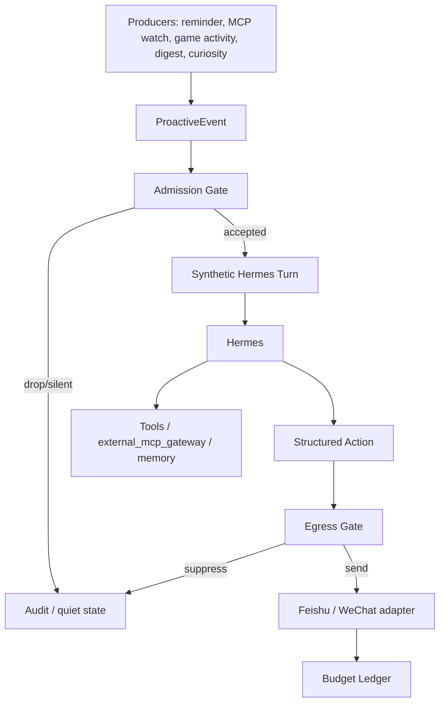

# Hermes Proactive Event Design

Status: CURRENT (2026-07-05)

Design status: target architecture and implementation contract. This document
does not claim the runtime has already changed. `docs/governance/current_runtime_status.md`
remains the source of truth for production behavior until implementation lands.

## Goal

Let Hermes proactively contact the user only when there is a real, timely,
evidence-backed reason, while retiring the old open-ended proactive check-in
path.

Hermes may wake, observe, remember, draft, or stay silent often. A user-visible
message should be rare and should feel like there was a concrete reason to say
something now.

## Non-Goals

- Do not restore `PERSONAL_AGENT_PROACTIVE_ENABLED` as a broad outbound switch.
- Do not let Python, Node, or an MCP producer write proactive message content
  directly to WeChat or Feishu.
- Do not send generic companion messages such as "recently busy, still okay?"
  or "just thinking of you."
- Do not let trending news, random feeds, or model curiosity notify the user
  unless the user explicitly subscribes to that scope.
- Do not weaken the existing external MCP pending-action policy for posts,
  comments, likes, account actions, purchases, deletes, or irreversible game
  costs.

## First Principles

Proactive messaging consumes the user's attention, runtime tokens, and trust in
Hermes. Therefore a visible proactive message requires all of:

1. Evidence: an observed event, tool result, reminder, game state, direct
   mention, watched thread change, or active task signal.
2. Scope: a user-enabled watch/reminder/activity/digest scope.
3. Timeliness: a reason the information matters now.
4. Budget: rate limits, quiet hours, and channel delivery checks.
5. Egress review: a final deterministic gate after Hermes drafts the message.

If any part is missing, the correct behavior is silent internal handling.

## Prior Art

- Cyberboss: useful pattern is stochastic/internal system turns, not random
  direct sends. The system wakes the agent and the agent chooses silence, state
  work, tools, or a short message. See
  `https://github.com/WenXiaoWendy/cyberboss`.
- MCP tools specification: tools are model-controlled, but clients should show
  exposed tools, confirm sensitive operations, validate tool results, apply
  timeouts, rate-limit, and treat tool annotations as untrusted.
  See `https://modelcontextprotocol.io/specification/2025-06-18/server/tools`.
- OpenAI Agents HITL and LangGraph interrupts: sensitive work should pause,
  persist state, surface an approval, and resume after a decision.
- OWASP LLM01: use least privilege and human approval for high-risk actions.

## Current Runtime Inventory

### Legacy Path To Retire

```text
Python scheduler life_loop_job
  -> LifeLoop companion opportunity
  -> PersonalAgentService.evaluate_life_opportunities
  -> Orchestrator proactive message composition
  -> OutboundChannel.send_text(kind="checkin")
  -> Node /outbound/send
  -> WeChat bot send
```

Important files:

- `src/personal_agent/scheduler.py`
- `src/personal_agent/jobs.py`
- `src/personal_agent/life_loop.py`
- `src/personal_agent/orchestrator_agent.py`
- `src/personal_agent/service.py`
- `src/personal_agent/outbound_channel.py`
- `node_bridge/src/outboundServer.mjs`
- `node_bridge/src/runtimeState.mjs`

This path bypasses the newer Hermes synthetic-turn model. It should not be
re-enabled.

### Allowed Paths To Preserve

- Scheduled AI daily digest:
  `Python ai_daily_digest_job -> Node /scheduled/ai-daily-digest -> ChannelHub -> Hermes -> Feishu`.
- External MCP system queue:
  `Node /external-mcp/system-queue -> ChannelHub -> replyBackend -> Hermes -> Feishu when notify is allowed`.
- Explicit user replies:
  normal WeChat/Feishu/Desktop inbound turns through `ChannelHub`.
- Reminders:
  preserve reminder storage and due-time logic, but migrate delivery away from
  the legacy proactive switch before enabling visible reminder sends.

## Target Architecture



Node and Python may produce events. Hermes writes the user-facing content.
Egress decides whether the final content is deliverable.

## ProactiveEvent Schema

Every producer emits a structured event:

```json
{
  "event_id": "stable-idempotency-key",
  "kind": "reminder|forum_watch|game_activity|digest|curiosity|maintenance",
  "global_user_id": "user-id",
  "channel": "feishu",
  "watch_scope": "forum:v2ex/topic/123",
  "reason": "watched thread received a direct reply",
  "evidence_refs": ["external_mcp_evidence:abc123"],
  "dedupe_key": "forum:v2ex/topic/123:reply:456",
  "created_at": "2026-07-05T10:00:00+08:00",
  "expires_at": "2026-07-05T11:00:00+08:00",
  "deliverability": "silent_only|draft_allowed|notify_allowed",
  "allowed_capability_tiers": ["T1", "T2"],
  "quiet_policy": "respect",
  "budget_class": "external_mcp|reminder|digest|curiosity"
}
```

Rules:

- The event contains facts and evidence references, not prose to send.
- `event_id` and `dedupe_key` must be stable enough to avoid duplicate sends.
- Raw credentials, cookies, session IDs, private logs, and long tool outputs are
  forbidden.
- Curiosity events default to `silent_only`.
- The public `/proactive/event` bridge endpoint is not a general external-event
  ingress. It currently accepts visible reminder delivery only. External MCP,
  forum, game, browser, curiosity, and maintenance notifications need a
  dedicated producer with its own watch/budget/evidence gate.

## Admission Gate

Admission runs before Hermes is invoked.

Required checks:

- Feature gate enabled for that event kind.
- User/channel target exists.
- Event is fresh and not deduped.
- Scope is enabled by a watch, explicit reminder, active activity grant, or
  scheduled digest setting.
- Trigger is strong enough:
  - direct mention/reply;
  - watched thread changed materially;
  - game is waiting for Hermes or has reached a configured share point;
  - explicit reminder is due;
  - scheduled digest time arrived;
  - active task threshold crossed.
- Evidence exists unless the kind is a user-created reminder or scheduled
  digest.
- External MCP evidence must verify against the local gateway evidence log for
  the same user, server, non-empty watch scope, and server-derived safe tier.
  Caller-provided evidence strings or caller-provided tier lists do not
  authorize notification.
- Quiet hours and snooze state pass.
- Rate budget is available.

Admission may produce one of:

- `drop`: invalid, stale, duplicate, or unsafe.
- `silent_internal`: safe for internal memory/tool work but not visible.
- `synthetic_turn`: Hermes should decide.

## Hermes Synthetic Turn Contract

The synthetic turn must be clearly marked as internal and not user-authored.
Hermes must return exactly one structured action after any allowed tool calls:

```json
{"action":"silent"}
```

```json
{"action":"remember","summary":"short durable note","evidence_refs":["..."]}
```

```json
{"action":"draft","message":"short draft","requires_confirmation":true,"evidence_refs":["..."],"why_now":"..."}
```

```json
{"action":"notify","message":"short user-visible message","evidence_refs":["..."],"why_now":"..."}
```

Hermes may call low-risk read tools allowed by the event's tier and session
policy. Hermes must not claim a read/action succeeded unless there is trusted
runtime evidence.

## Egress Gate

Egress runs after Hermes produces a structured action.

Suppress when:

- The action is missing, malformed, `silent`, or `remember`.
- `deliverability` is `silent_only`.
- The message is empty, too long, or contains markdown/tool traces.
- The message is generic check-in text.
- The message lacks event-specific evidence.
- `why_now` is absent for watch/game/forum notifications.
- The action claims external reads or effects without trusted evidence.
- Quiet hours, snooze, stop state, or rate limits changed while Hermes was
  running.

Send only when:

- `action=notify`.
- `deliverability=notify_allowed`.
- The message passes generic-text and evidence checks.
- The adapter send succeeds.

Notification budget must use a short reservation lease before Hermes runs so
concurrent events cannot overrun the scarce daily slot. The lease is committed
only after successful adapter send and released for `silent`, malformed, or
failed sends.

## Budget Defaults

- External MCP notifications: 1 per user per day.
- Per external MCP server: 3 per week.
- Per topic/thread/game scope: 24 hour cooldown.
- Game activity share: configurable per scoped grant, default every 5-10
  meaningful turns or at milestone/end.
- Explicit reminders: separate reminder budget; no generic companion budget.
- Scheduled AI digest: separate opt-in digest budget.
- Curiosity: silent-only until the user explicitly changes it.

## User Controls

Minimum command surface:

- `/proactive status`
- `/proactive off`
- `/proactive quiet until <time>`
- `/proactive snooze <scope> <duration>`
- `/watch list`
- `/watch remove <watch-id>`
- `/mcp stop` or natural stop phrases for activities

Commands must be owner-scoped where they affect executable capabilities,
external MCPs, or delivery settings.

## Legacy Retirement Plan

Implementation should proceed in this order:

1. Add tests that prove old check-in delivery is rejected even if
   `PERSONAL_AGENT_PROACTIVE_ENABLED=true`.
2. Decouple reminders from `PERSONAL_AGENT_PROACTIVE_ENABLED` and route due
   reminder events through the ProactiveEvent pipeline.
3. Disable or remove companion opportunity generation from `LifeLoop`.
   Keep background reflection, memory maintenance, knowledge maintenance, and
   night-cycle jobs.
4. Remove or deprecate direct proactive message composition in
   `orchestrator_agent.py`.
5. Change `/outbound/send` so `kind=checkin` is permanently rejected or mapped
   to a non-visible migration error. `force=true` and media payloads must not
   bypass the retired route.
6. Ignore or purge stale `pending-outbound.json`, `proactive-dispatch.json`,
   and check-in range state during deploy.
7. Rename env and docs so broad proactive no longer sounds supported. New envs
   should be event-specific, for example:
   - `HERMES_PROACTIVE_EVENTS_ENABLED`
   - `HERMES_PROACTIVE_REMINDERS_ENABLED`
   - `HERMES_PROACTIVE_EXTERNAL_MCP_ENABLED`
   - `HERMES_PROACTIVE_CURIOSITY_MODE=silent_only|off`
8. Update Hermes profile instructions, runtime docs, diagnostics, and tests.

## Implementation Tracks

### Track 1: Event Model And Gates

- Add a shared ProactiveEvent validator.
- Add admission and egress modules with unit tests.
- Reuse external MCP watchlist and rate-budget concepts where possible.

### Track 2: External MCP Queue Hardening

- Extend `/external-mcp/system-queue` to carry evidence refs, dedupe keys,
  expiration, and budget class.
- Use a short budget reservation before Hermes, then commit it only after
  successful adapter send or release it when Hermes stays silent/suppressed.
- Verify external MCP evidence refs against the local gateway evidence log;
  caller-supplied strings are not evidence, empty watch scopes cannot be reused,
  and allowed evidence tiers are derived from the registered watch kind.
- Require structured `notify` output for visible messages.

### Track 3: Reminder Migration

- Convert due reminders into ProactiveEvents.
- Let Hermes write the reminder message only when delivery is enabled.
- Keep reminder delivery independent from old check-in proactive.

### Track 4: Legacy Removal

- Remove old check-in sends and queue flush behavior.
- Keep internal maintenance jobs that do not send messages.
- Update env contracts and deployment script.

### Track 5: Diagnostics

Add a diagnostic script that reports:

- Proactive event gates and envs.
- Whether legacy check-in delivery is disabled.
- Reminder event routing status.
- External MCP system queue status.
- Feishu/WeChat delivery target availability.
- Last suppressed/sent proactive events, without secrets or raw private data.

## Testing Requirements

Node unit tests:

- Malformed Hermes structured output is suppressed.
- `silent` and `remember` never send visible text.
- Generic check-ins are rejected.
- `/proactive/event` rejects non-reminder visible notification events; external
  MCP/forum/game events must use the trusted system queue.
- Budget is recorded only after adapter send succeeds.
- External MCP queue cannot notify without watch scope, trusted evidence, and a
  server-derived allowed tier.
- Stop/snooze state suppresses pending notifications.

Python unit tests:

- Scheduler no longer registers open-ended companion delivery.
- Reminders do not require `PERSONAL_AGENT_PROACTIVE_ENABLED`.
- Reminder due events are idempotent and deduped.
- Daily digest remains independent.

Integration tests:

- A watched external MCP event creates a synthetic Hermes turn and stays silent
  when Hermes returns `silent`.
- A watched external MCP event sends only when Hermes returns valid `notify`
  with evidence.
- A due reminder reaches Hermes and sends only when reminder delivery is
  enabled.
- Enabling any new proactive event env does not re-enable old check-ins.

## Acceptance Criteria

- No runtime path can send old life-loop/check-in messages.
- Hermes receives proactive work only as synthetic turns.
- All visible proactive messages pass admission, Hermes decision, and egress.
- Reminders, AI digest, and external MCP notifications have separate budgets.
- Notification budget is reserved before Hermes to prevent concurrency races,
  charged after successful send, and released on suppressed/failed sends.
- User can stop, snooze, or disable proactive scopes.
- Existing normal chat, AI daily digest, external MCP policy, and pending-action
  gates remain intact.
- No secrets, cookies, tokens, local session files, raw logs, or private caches
  are committed or exposed in docs.

## Documentation To Update During Implementation

- `docs/governance/current_runtime_status.md`
- `docs/governance/server_runtime_commands.md`
- `docs/governance/hermes-action-contract-gate.md`
- `hermes/profile/AGENTS.md`
- `scripts/diagnose-*.sh` references
- Tests that still describe the retired check-in path as supported behavior
