# Hermes Core Reliability, Personal Learning, And One-Shot Runtime Design

Status: CURRENT (2026-07-13)

Design status: PROPOSED. This document defines a target design and does not
claim that the behavior is deployed. Production truth remains in
`docs/governance/current_runtime_status.md` until implementation, verification,
and rollout pass.

Some supporting components landed in the reliability release deployed at
`3f6e7b705854838d9a1e8b466d959f7ead41b643`. That does not make this complete
target design deployed: the definition of done, especially unified
final-delivered history and memory/session control, remains proposed.

## Purpose

Make Hermes a dependable daily companion without requiring the user to act as
her prompt engineer, runtime operator, or action verifier.

This design owns problems that do not depend on an external MCP:

- truthful action claims;
- actor-bound authorization and confirmation;
- real delivery state;
- durable promises and background jobs;
- atomic runtime state;
- personal learning and reflection;
- automatic lite/full/model routing;
- isolated tests and one-command deployment.

External MCP discovery, sessions, domain activities, capability learning, and
game/forum/embodied execution are owned by
`2026-07-10-hermes-external-mcp-autonomy-capability-growth-design.md`.

This design supersedes the unexecuted non-external-MCP reliability and final
rollout work in
`docs/superpowers/plans/2026-07-09-hermes-stability-one-shot-deploy.md`. Landed
fixes and Git history remain valid.

## User Experience Contract

The user should be able to talk to Hermes in ordinary language. The runtime,
not the user, owns technical correctness.

1. Ordinary chat never asks the user to choose lite/full, a model, a service,
   a transport, or a diagnostic command.
2. An explicit instruction such as “记住这个” or “现在发给她” is the
   authorization for that exact bounded action. Hermes does not ask for a
   redundant second confirmation.
3. Ambiguous high-impact intent may create one actor-bound pending action.
   Confirmation happens once for the complete bounded effect, not once per
   internal step.
4. Hermes may say that an action completed only after the runtime has a matching
   receipt for the same actor, action, scope, and operation.
5. Hermes may promise to continue later only after a durable job and its next
   wake have been committed.
6. A message is remembered as sent only after the channel adapter reports a
   committed or explicitly ambiguous outcome.
7. Internal policy names, tool names, profile names, IDs, paths, logs, and bridge
   fallback language never appear in normal conversation.
8. Hermes learns stable preferences and corrections automatically, but does not
   turn guesses, one-off moods, raw chat, or tool output into durable personal
   facts.
9. Failures are recovered internally when safe. When recovery is exhausted,
   Hermes gives one natural, factual explanation and does not hand the user a
   repair procedure.

## Verified Problems That This Design Must Close

These are current design or implementation defects, not speculative features.

| Area | Current problem | Required correction |
|------|-----------------|---------------------|
| Action truth | Claim detection and evidence satisfaction can accept an unrelated successful result or miss paraphrased success claims. | Bind claims to typed operation receipts, not generic success evidence or a finite synonym list. |
| Pending actions | Lookup is primarily channel/conversation-bound and does not prove the confirming actor. | Bind creation and confirmation to owner, sender, channel, conversation, action digest, and expiry. |
| Delivery truth | The assistant timeline and backend ingest can be updated before the real adapter send finishes. | Reserve, send, commit, then expose the assistant turn to timeline/ingest. |
| Future promises | Model prose can imply later work even when no durable job exists. | A future-tense action promise requires a committed job receipt. |
| Runtime state | Several JSON/JSONL paths use direct writes and permissive empty-state recovery. | Use one owner per state file, atomic replacement, schema validation, and fail-closed corruption handling. |
| Model burden | The user may be asked to choose profile/model or repeat instructions after fallback. | Route automatically and preserve the same task through fallback. |
| Personal learning | Memory and reflection exist, but there is no single promotion contract separating evidence-backed learning from speculation. | Add a small candidate/active/superseded learning lifecycle on existing memory storage. |
| Release evidence | Large happy-path test counts have coexisted with end-to-end failures and production-state fixture pollution. | Gate rollout on adversarial journeys under isolated state, not test count. |

## First Principles

### 1. Text is not an execution receipt

A model can request an action and describe a result, but it cannot prove that
the action occurred. Only the executor and channel adapter can create trusted
receipts.

### 2. Authorization is attributable

“确认” has meaning only when it comes from the same trusted actor, in the same
bounded context, for the same pending effect. Conversation proximity is not
authorization.

### 3. Delivery is part of the action

Generating a reply, ingesting it, and delivering it are different states. A
system that records a reply before delivery creates false shared history.

### 4. A promise is a durable object

If the process cannot resume the work after a restart, Hermes must not promise
to finish it later.

### 5. Learning needs evidence and forgetting

Growth is not accumulating more prompt text. Useful learning is a small,
correctable set of stable preferences, user corrections, and proven operating
lessons with provenance, confidence, and supersession.

### 6. Weak-model tolerance is a runtime property

Hermes may omit a tool call, return malformed structure, choose the wrong
profile, or phrase a claim unexpectedly. The deterministic runtime must keep
authorization, task state, and truth intact despite those failures.

## Options Considered

### Option A: Improve prompts and expand claim regexes

Rejected. It requires an unbounded vocabulary list and keeps authorization and
truth dependent on probabilistic text.

### Option B: Add another classifier or reviewer model to every turn

Rejected as the default path. It increases cost and latency, creates
disagreement between models, and still cannot prove execution or delivery.

### Option C: Typed runtime receipts with targeted model use

Selected. Hermes remains the single visible speaker. Deterministic runtime
state owns identity, authorization, action receipts, jobs, and delivery. A
stronger model is invoked automatically only for genuinely difficult reasoning,
not for routine validation that code can perform.

## Target Architecture

```mermaid
flowchart LR
  User["Owner / trusted user"] --> Hub["ChannelHub"]
  Hub --> Context["Trusted Turn Context"]
  Context --> Router["Automatic lite/full/model router"]
  Router --> Hermes["Hermes"]
  Hermes --> Request["Structured Action Request"]
  Request --> Consent["Consent and actor binding"]
  Consent --> Executor["First-party executor"]
  Executor --> Receipt["Typed Action Receipt"]
  Receipt --> Egress["Claim and privacy gate"]
  Egress --> Outbox["Durable Outbox"]
  Outbox --> Adapter["WeChat / Feishu adapter"]
  Adapter --> Commit["Delivery commit"]
  Commit --> Timeline["Timeline and backend ingest"]

  Commit --> Learning["Personal learning candidates"]
  Learning --> Memory["Existing Ombre / SQLite / vault"]
```



The architecture reuses the current ChannelHub, reply backend, identity map,
timeline, action executors, memory system, and lite/full gateways. It does not
add a general agent framework, a new queue service, or a second conversation
runtime.

## Protected Existing Capability Plane

The current first-party MCPs and knowledge services are protected assets, not
inputs to a uniform rewrite. This release may add private trust, durability, and
acceptance adapters around them, but it must not change their public tool names,
input schemas, structured results, markers, profile exposure, state ownership,
or default routing unless this design names the change explicitly.

The protected plane is versioned in
`docs/governance/hermes_protected_capabilities.v1.json` and includes:

- `search_hub` as the normal fresh-search and ordinary-URL front door, while
  actual social links remain owned by `social_reader` and `media_reader`;
- the public-only Xiaohongshu chain, Bilibili subtitle/audio/video degradation,
  WeChat article handling, NetEase read-only metadata, and partial-result
  semantics already implemented by `social_reader`/`media_reader`;
- `personal_memory` as a three-tool read-only Hermes bridge backed by the Python
  memory policy, SQLite, and Ombre, without bulk per-turn injection;
- `obsidian_memory` as optional read-only vault search with a derived CPU index,
  not a replacement memory database;
- the provider-neutral background `knowledge_agent` and its
  `vault/inbox -> raw/wiki` plan/apply/cleanup flow, which is not a frontline
  Hermes MCP;
- full-only `co_reading`, including its gzip-body/SQLite-metadata split,
  private/shared annotation boundary, Tailscale-only Web surface, and explicit
  shared deposit into the vault;
- `sticker_catalog`, `media_generation`, `time`, and full-only `playwright`,
  including the existing `RAN_MEDIA`/`WECHAT_MEDIA` bridge markers and profile
  split.

Core receipt fields are private bridge state. They must not be added to public
MCP `tools/list`, tool arguments, structured results, media markers, or model
history. The current Hermes child-process MCP path does not itself provide a
non-model-overridable tool-result trace to `ChannelHub`. Therefore a tool result
copied through Hermes is never upgraded into a trusted receipt. A first-party
receipt may be minted only at a real bridge-owned executor boundary, or after a
verified runtime tool-trace hook is proven by an integration test. Until that
boundary exists, the release preserves the mature read/marker behavior and
fails closed only for unsupported effect/completion claims; it does not disable
the existing readers or invent a receipt wrapper around model JSON.

The Core outbox governs channel delivery, not every internal response surface.
It must preserve trusted `RAN_MEDIA`/`WECHAT_MEDIA` markers byte-for-byte through
the existing channel adapters. Co Reading Web HTTP responses, browser tokens,
owner tokens, private annotations, and book storage do not pass through the
chat outbox; only an actual Hermes-authored channel reply does.

### Link-reading preservation contract

- Xiaohongshu stays public-only: canonicalize the link, use the fixed public
  parser marker, try the local public sidecar with empty cookie and no download,
  then the generic public parser and bounded HTML/OG fallback; discovered media
  enters `media_reader` with per-asset partial results. No account, QR, cookie,
  feed/profile/search, comment, or private-content path is restored.
- Bilibili/b23 keeps safe URL resolution, Bilibili metadata, and the configured
  media resolver with MCP-first/yt-dlp fallback. Understanding remains
  subtitle-first, then bounded audio, bounded frames, and metadata-only. HTTP
  412/403, auth, proxy, and missing dependencies remain typed partial failures;
  no credential or proxy value is exposed.
- WeChat articles remain restricted to the allowed public article host and
  static extraction. Captcha, abnormal-environment, or dynamic-content failure
  is reported honestly and is not bypassed with a user browser session.
- NetEase shares remain read-only song metadata for the supported public hosts
  and short links. They do not control playback or access private playlists.
- `search_hub` hands actual social links to `social_reader`; Co Reading imports
  social URLs through `social_reader` and ordinary URLs through `search_hub`.
  Neither subsystem creates a replacement crawler.
- Domain partial-success classification remains inside the dedicated reader.
  Core verifies only whether the claimed observation/effect is supported; it
  does not collapse “some media understood” into total failure or equate URL
  resolution/metadata with complete content reading.

## Core Contracts

### Trusted turn context

Channel adapters create a private context that model text cannot override:

```json
{
  "actorKey": "hash of bound global user and sender",
  "owner": true,
  "platform": "wechat",
  "channelType": "dm",
  "conversationKey": "hash",
  "messageKey": "stable inbound id",
  "receivedAt": "ISO-8601"
}
```

Fallback identities may support conversation continuity, but they are never
proof of owner authority. Trusted context is passed by reference inside the
runtime and is excluded from normal model-visible history.

The persisted identity map is versioned and stores an explicit
platform/sender binding, global user, `owner` flag, provenance, and creation
time. Migration may preserve an existing explicit binding, but it must never
infer owner authority from the legacy `user:ran` fallback. Production preflight
requires at least one real owner binding without printing the underlying
identity; if none exists, deployment stops with that single concrete bootstrap
blocker.

### Action request

Hermes can express intent through a small structured sidecar or an existing
first-party tool call:

```json
{
  "requestRef": "a1",
  "actionType": "memory_write",
  "scope": {"memoryKind": "preference"},
  "payloadRef": "private runtime reference",
  "requestedAuthorizationBasis": "explicit_current_turn"
}
```

Hermes does not supply the operation identifier, actor identity, recipient
authority, policy tier, consent decision, or evidence. The runtime mints the
operation identifier, binds the normalized request in a private operation
ledger, and derives authority from trusted context. Any model-supplied value in
those fields is ignored or rejected.

### Private reply envelope and semantic claim verification

Hermes returns a private structured envelope while the user sees only
`message`:

```json
{
  "schemaVersion": 1,
  "message": "自然回复",
  "actionRequests": [
    {"requestRef": "a1", "actionType": "memory_write"}
  ],
  "claims": [
    {"requestRef": "a1", "claimType": "memory_saved"}
  ],
  "commitments": [
    {"requestRef": "j1", "claimType": "continue_later"}
  ]
}
```

`requestRef` is an envelope-local correlation label with no authority. After
parsing, the runtime mints operation/job identifiers and binds every declaration
to the corresponding trusted receipt. Hermes never needs to predict or repeat a
private runtime identifier.

Provider/schema enforcement and one bounded repair handle malformed envelopes.
The envelope is a useful declaration, not proof. Before egress, a compact
semantic verifier compares the natural `message` with the declared claims,
commitments, and available typed receipts. It is allowed to detect paraphrases
but cannot authorize an action or create evidence.

The verifier receives every visible reply because a hallucinated action claim
can appear even when no executor ran. Its input is deliberately tiny: final
message, declared claim/commitment types, and sanitized receipt summaries. A
low-latency model is sufficient; it does not receive the full conversation or
tools. If the verifier is unavailable, the runtime fails closed with one short
neutral availability notice that is excluded from Hermes history; it does not
send an unverified Hermes-authored reply. If verification finds an unsupported
claim, one bounded rewrite keeps the conversational content while removing that
claim. A finite phrase regex is not the semantic authority.

### Typed action receipt

Every executor returns a receipt even when it fails:

```json
{
  "operationId": "op_...",
  "actorKey": "hash",
  "actionType": "memory_write",
  "scopeDigest": "hash",
  "status": "succeeded|failed|partial|ambiguous",
  "effectDigest": "hash",
  "evidenceType": "memory_write_result",
  "issuer": "bridge:python-memory-adapter",
  "nonce": "single-use runtime nonce",
  "expiresAt": "ISO-8601",
  "createdAt": "ISO-8601"
}
```

A claim is allowed only when its required evidence type and operation binding
match. A successful read cannot prove a save; a successful tool from another
operation cannot prove a send; progress cannot prove completion.

Receipt trust comes from the executor path, not from the JSON shape. In-process
executors receive a private operation capability from the ledger. A
cross-process executor is invoked only through a bridge-owned authenticated or
synchronous private adapter; the bridge validates its bounded result against
the registered operation before issuing the receipt. Hermes text, MCP content,
tool output copied through the model, and model-supplied receipt objects are
never upgraded into trusted receipts. Nonces/timestamps and the operation
ledger prevent replay.

The action gate may use semantic analysis to find action-bearing claims, but
semantic detection never creates authorization or evidence. When the model
omits a claim sidecar, the gate may conservatively remove unsupported success
language without exposing bridge internals.

### Actor-bound pending action

A pending action stores only sanitized and bounded metadata:

```json
{
  "actionId": "act_...",
  "actorKey": "hash",
  "platform": "wechat",
  "conversationKey": "hash",
  "actionType": "external_send",
  "actionDigest": "hash of recipient, content reference, and bounds",
  "status": "pending",
  "expiresAt": "ISO-8601"
}
```

Confirmation succeeds only when actor, platform, conversation, action digest,
status, and expiry all match. Confirmation is single-use. A different sender,
channel, conversation, stale message, or changed payload cannot execute it.

### Durable job receipt

A visible promise to continue later requires:

```json
{
  "jobId": "job_...",
  "actorKey": "hash",
  "goalDigest": "hash",
  "status": "active",
  "nextRunAt": "ISO-8601",
  "terminalStates": ["completed", "blocked", "stopped", "expired"]
}
```

The reply backend may allow future-tense commitment language only after the job
record and its first wake are committed. Every accepted job must eventually
enter one terminal state and, when appropriate, produce one final delivery.

External MCP activities use their specialized supervisor but must satisfy this
same promise contract.

### Durable outbox

Visible delivery uses this state machine:

```text
reserved -> sending -> sent
                    -> failed
                    -> ambiguous
```

Rules:

- Reserve before calling an adapter.
- Feishu uses a stable idempotency key derived from the outbox item.
- A known failure may be retried within a bounded policy.
- An unknown WeChat outcome becomes `ambiguous`; it is reconciled when possible
  and is never blindly resent.
- Append the visible assistant turn to timeline and backend ingest only after
  `sent` commit.
- `ambiguous` may be recorded as delivery metadata, but not as a confirmed
  visible assistant turn.
- Provider follow-up fragments are collapsed into one coherent candidate before
  verification and one outbox commit. No asynchronous follow-up sender bypasses
  the shared gate.

Delivery and history projection are separate durable facts. Each sent outbox
item records whether the global timeline and backend-ingest projections have
committed. Both projections accept the stable outbox identifier as an
idempotency key. Startup replays `sent` items whose projections are incomplete;
it never resends the adapter call merely to repair history.

### Atomic runtime state

Each critical state file has one process owner. Writes use a shared helper with:

1. schema validation;
2. same-directory temporary file;
3. file flush;
4. atomic rename;
5. directory flush where supported;
6. restrictive mode and service ownership.

Read failure is classified as missing, incompatible, or corrupt. Missing state
may initialize safely. Corrupt critical state is quarantined and fails closed;
it must never silently become an empty list that loses authorizations, jobs, or
delivery records.

The design deliberately keeps existing project-local files rather than adding
a database or queue service. Cross-process components may exchange immutable
receipts, but they do not concurrently edit the same state file.

## Confirmation Policy

### No additional confirmation

- Exact, explicit action authorized in the current trusted turn.
- Ordinary chat, read-only operations, media analysis, and public search.
- Low-risk repair that cannot create a new external effect.
- Updating a non-executable personal preference from an explicit correction.
- Retrying a known failed idempotent operation within its existing scope.
- Internal lite/full/model routing or service recovery.

### One combined confirmation

- Ambiguous request that may create a third-party send or durable destructive
  change.
- A new standing consent boundary with a clear actor, target, duration, rate,
  and effect limit.
- Enabling a newly generated executable capability, as defined by the external
  MCP autonomy design.

After confirmation, all internal steps inside the approved digest execute
without further questions.

### Deny

- Actor, target, payload, or impact cannot be bounded.
- The confirmer is not the original authorized actor.
- A stale confirmation refers to changed content or recipient state.
- The requested effect exceeds its standing consent or cannot produce a trusted
  receipt.

Denials are rendered as natural language. Policy dumps and repair commands are
not user-visible.

## Automatic Model And Profile Routing

Full and lite remain intentional capability profiles.

- Lite remains the default for daily conversation and low-risk first-party
  capabilities.
- Full remains available for bounded terminal, file, browser, generation, and
  debugging tasks.
- A stronger configured reasoning model may be selected automatically for a
  bounded difficult task. The visible speaker remains Hermes.
- Profile and model choice are runtime metadata, never a user decision or a
  security grant.
- If the preferred route is unavailable, fallback preserves the same operation
  and trusted context. It does not ask the user to restate the goal.
- Fallback cannot widen capability scope. Full authority is derived from the
  trusted request and policy, not from the selected endpoint.

Routine deterministic checks never invoke a second model merely because one is
available.

## Personal Learning And Growth

Personal learning uses the existing Ombre/SQLite/vault storage boundary. It
does not create a second memory database and does not inject raw history into
every turn.

The lifecycle classifies new stable personal facts; it is not a migration of
all existing memory and knowledge content. Existing Ombre buckets, SQLite
memory, knowledge-agent artifacts, vault documents, and co-reading deposits
remain readable through their current owners. Legacy memory/reflection/night
cycle producers may continue to create their existing non-authoritative
artifacts through a compatibility adapter. Only a new fact that is promoted as
a stable preference, correction, relationship, routine, or operating lesson is
subject to `candidate -> active`; “active-only recall” applies to that new
learning view, not to ordinary memory recall or vault knowledge search.

### What may be learned automatically

- Explicit stable preferences and corrections.
- Repeated conversational preferences supported by multiple observations.
- User-defined names, relationships, recurring routines, and standing consent
  boundaries when their meaning is explicit.
- Proven runtime lessons such as “do not repeat a checkpoint after ambiguous
  WeChat delivery,” stored as non-executable operating knowledge.

### What may not be promoted automatically

- A diagnosis inferred from one failure.
- A transient emotion treated as a stable trait.
- Model speculation, hidden reasoning, raw tool output, or raw chat logs.
- Raw social posts, comments, signed media URLs/files, resolver traces, or
  internal reader markers. A later sanitized user-authored conclusion may be a
  candidate; the fetched payload itself is never personal growth memory.
- Credentials, cookies, tokens, private file paths, or session state.
- Executable code, skills, hooks, plugins, MCP enablement, or permission
  expansion. Those follow capability governance and the external design's
  candidate/evaluation/first-boundary approval path.

### Learning record

```json
{
  "learningId": "learn_...",
  "kind": "preference|correction|relationship|routine|operating_lesson",
  "subjectKey": "bounded semantic key",
  "statement": "short sanitized fact",
  "source": "explicit_user|repeated_observation|verified_outcome",
  "evidenceDigests": ["hash"],
  "confidence": 0.95,
  "status": "candidate|active|superseded|forgotten",
  "lastConfirmedAt": "ISO-8601"
}
```

Rules:

- Explicit user corrections may become active immediately.
- Inferred preferences require repeated, non-contradictory observations.
- A new explicit correction supersedes the old record atomically.
- Low-confidence and stale candidates expire.
- The user can ask what Hermes remembers, correct it, or forget it.
- Recall injects only the smallest relevant active records within existing
  memory budgets.
- Reflection and promotion run at low frequency, never as mandatory per-turn
  maintenance.

Capability-domain experiences such as game strategies and forum interaction
outcomes belong to the external MCP design and are not mixed with personal
identity memory.

## Conversation And Failure Rendering

- Hermes remains the only normal first-person speaker.
- Bridge-authored safety or delivery failures use short factual language and
  are excluded from Hermes history.
- Internal terms such as gate, policy, pending action, profile, session, token,
  service, ledger, evidence ref, and absolute path are blocked at egress unless
  the user explicitly asks for technical diagnostics.
- A recovery message states what is known, what remains unknown, and whether the
  task stopped. It does not invent a cause.
- One operation produces at most one coherent visible result per checkpoint.
- Quick acknowledgement stays disabled unless it is backed by a committed
  durable job and adds real user value.

## Existing Runtime Guarantees And Regressions Included

This release also closes the non-external-MCP drift already identified in the
superseded stability plan. These are regression obligations, not new parallel
subsystems:

- Keep ordinary quick acknowledgement disabled. Any future acknowledgement that
  promises later work must reference a committed durable job.
- Keep the AI daily digest at the managed `08:00 Asia/Shanghai` schedule. Facts
  dependency failure degrades to an honest partial digest, and the sent marker
  is committed only after real channel delivery.
- Preserve lite session continuity and the existing soft-reset mechanism.
  Provider accumulation detection must be paired with a pending digest/reset;
  it cannot log a warning and continue unbounded.
- Preserve bounded reply and adapter timeouts without turning a timeout into a
  fake completion or duplicate send.
- Converge service-user ownership and write access for every Core-managed state
  directory. Manual `chmod`, env edits, or systemd overrides are diagnostics,
  not release steps.
- Keep Ombre and existing memory backends on their own health and diagnostic
  paths. Core personal-learning changes reuse them but do not couple their
  availability to game/forum activity or ordinary message delivery.
- Freeze the current production Ombre revision and requirements fingerprint for
  this release. `prepare-ombre-brain.sh` and service restart must not update its
  source or reinstall a different dependency set. Playwright, time, and optional
  Obsidian fallback versions are likewise captured and held; any upstream
  upgrade is a separate reviewed change.
- Preserve the protected full/lite MCP profile, public tool schemas, data roots,
  and routing/degradation behavior. A release-time capability snapshot is
  compared before apply, after apply, and after rollback without reading private
  memory or vault content.
- Keep bridge-authored neutral notices out of Hermes recent/global assistant
  history so she cannot learn or repeat them as her own voice.

## One-Shot Release Package

The design is delivered as one production change, not a user-visible roadmap.
The implementation may use local commits and isolated tests, but production is
mutated by one idempotent command that owns:

- preflight under the real service user;
- managed environment and profile convergence;
- state schema validation and migration on copies;
- permissions and atomic-write smoke;
- service restart;
- deterministic synthetic end-to-end tests;
- automatic rollback of env, profiles, service configuration, and compatible
  state when a release gate fails.

The command reports only success or rollback with a sanitized reason code. It
does not give the user a list of manual repairs.

## Adversarial Release Gate

Deployment is blocked unless all of these pass under an isolated state root:

1. `save` failure plus unrelated successful read cannot produce “已保存”.
2. `send` failure plus another successful tool cannot produce “已发送”.
3. Paraphrases such as “搞定”“办妥”“已经投递” are subject to the same receipt
   requirements without using them as authorization.
4. A missing or unavailable semantic verifier cannot release an unverified
   Hermes-authored reply or leak its internal failure into Hermes history.
5. Another sender, channel, conversation, or stale replay cannot confirm a
   pending action.
6. An explicit bounded current-turn instruction executes without a redundant
   second confirmation.
7. Adapter failure never creates a sent assistant timeline turn.
8. Process termination at every outbox transition produces no false sent state
   and no blind duplicate.
9. Read-only, truncated, incompatible, and corrupt state fail safely without
   silently resetting active jobs or pending effects.
10. A promised background job survives restart and reaches exactly one terminal
   state.
11. Model output with malformed or missing action structure cannot widen
    authorization or create a false receipt.
12. Lite/full/model failure is recovered internally without asking the user to
    choose a route or repeat the task.
13. Explicit preference corrections replace old learning; speculation and raw
    logs never become active memory.
14. AI digest dependency failure does not mark a digest sent before adapter
    commit, and the effective managed schedule remains 08:00 Asia/Shanghai.
15. Provider accumulation warning is paired with a recoverable lite soft reset
    and resume digest rather than unbounded session growth.
16. Quick acknowledgement remains off unless a matching durable job is already
    committed.
17. Tests cannot read or write the real `.ran_agent_state`, live registry,
    credentials, or production memory.
18. Normal user-visible replies contain zero internal IDs, policy dumps, tool
    traces, bridge repair instructions, or false completion claims.
19. Protected MCP names, profile membership, public tool schemas/results,
    `RAN_MEDIA`/`WECHAT_MEDIA` semantics, and state-owner realpaths match the
    pre-deploy capability snapshot; no private receipt field enters them.
20. Real XHS, Bilibili/media, Search Hub, personal-memory, co-reading, sticker,
    time, and applicable full-profile browser/Ombre smoke journeys retain their
    current behavior on the server; a synthetic broker/game happy path cannot
    substitute for these checks.
21. Ombre, Playwright, time, and optional Obsidian runtime versions do not drift
    during deploy or restart; a mismatch rolls back before GitHub archival.

The gate measures these invariants, not the number of passing unit tests.

## Explicit Non-Goals

- No redesign of external MCP admission, game play, forum activity, or embodied
  control in this document.
- No general-purpose workflow framework, message broker, or new database.
- No second visible assistant or replacement frontend runtime.
- No unrestricted self-modification.
- No per-turn reflection or unbounded memory injection.
- No promise of exactly-once WeChat delivery when the remote result is
  unknowable; ambiguous outcomes are represented honestly.

## Definition Of Done

This design is complete when ordinary conversation no longer requires the user
to select technical routes, verify whether Hermes acted, repeat a durable goal,
or interpret bridge internals; every visible action claim and delivery is
grounded in an actor-bound typed receipt; stable personal corrections are
learned automatically and remain correctable; and the complete runtime change
can be deployed or rolled back with one command.
