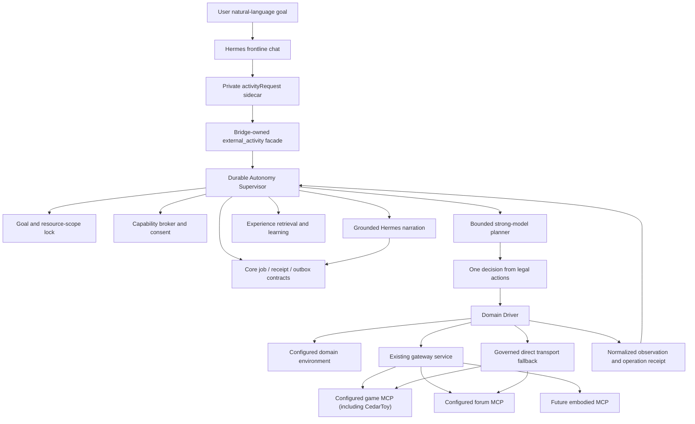

# Hermes External MCP Autonomy And Capability Growth Design

Status: HISTORICAL DESIGN / PARTIALLY IMPLEMENTED (2026-08-18)

This is no longer a current target or execution authority. Use
`docs/governance/external-mcp-gateway.md` for the implemented capability plane
and `docs/governance/current_runtime_status.md` for production truth.

Generic autonomy, conformance promotion, and other unimplemented ideas remain
historical proposals unless re-authorized in `docs/governance/active_sequence.md`.

## Purpose

Give Hermes a reusable autonomy runtime for external MCP environments so that
adding another game, a forum, or a future embodied system does not require the
user to teach Hermes a new low-level protocol or rebuild persistence, safety,
recovery, learning, and delivery.

This design does not choose a game vendor, forum product, or embodied provider.
The current CedarToy connection remains a supported configured environment; a
future forum or other MCP enters through the same manifest/driver contract. A
reference implementation or conformance fixture may prove the generic runtime,
but it never becomes the user's production provider by being named in this
specification.

Each connected environment publishes a verified capability matrix. Missing
terminal, idempotency, revision, or reconciliation facts narrow only the claims
and retries that depend on them; they do not disable the whole MCP or replace it
with a different product. For example, a CedarToy game without a typed terminal
may remain a durable ongoing activity that resumes, reports observed
checkpoints, and stops cleanly, while Hermes simply does not claim “通关”.

Embodied MCPs are specified as a stricter safety envelope, not claimed as a
currently implemented driver.

This design replaces the unexecuted target architecture in
`2026-07-10-hermes-durable-game-autonomy-design.md`. It preserves already-landed
external MCP registry, admission, policy, session, evidence, stop, and transport
work where those components satisfy this design. It also supersedes the
low-level model-orchestration parts of
`2026-07-01-hermes-external-mcp-capability-plane-design.md`; that document
remains useful history and evidence for the landed capability plane.

The shared identity, typed-receipt, durable-job, outbox, atomic-state, personal
learning, model-routing, and deployment contracts are owned by
`2026-07-10-hermes-core-reliability-learning-one-shot-runtime-design.md`.

## Ownership Boundary

| Concern | Owning design |
|---------|---------------|
| Trusted actor identity, action receipts, pending confirmation, durable promises, outbox, timeline commit, atomic file semantics | Core reliability |
| Personal preferences, relationship facts, conversational corrections, low-frequency self-review | Core reliability |
| External MCP registry, discovery, sessions, transport, resource scope, activity state, generic-adapter execution, capability experience | External MCP autonomy |
| Game/forum/embodied risk envelopes and reconciliation | External MCP autonomy |
| Skill, hook, plugin, MCP, and settings activation inventory | Agent capability governance |

The documents are separate release specifications, but they do not create
parallel identity, evidence, job, approval, memory, or delivery systems.

## Protected First-Party Capability Boundary

The External supervisor is a broker for newly admitted external environments;
it is not a replacement router for mature first-party MCPs. Registry,
discovery, declarative mapping, generated drivers, and runtime activation must
reject collisions with these reserved server names and tool prefixes:

`search_hub`, `social_reader`, `media_reader`, `personal_memory`,
`obsidian_memory`, `ombre_memory`, `ombre_memory_extra`, `co_reading`,
`sticker_catalog`, `media_generation`, `time`, and `playwright`.

The stable result is `PROTECTED_CAPABILITY_NAME_COLLISION`. A candidate cannot
shadow one of these names, edit `hermes/profile/config*.yaml`, insert an
equivalent low-level toolset, redirect a protected launcher/provider, or claim
that its result is a Core receipt. Exact profile/tool/data-owner requirements
come from `docs/governance/hermes_protected_capabilities.v1.json` and the live
sanitized capability snapshot.

In particular, External does not absorb the XHS/Bilibili/WeChat/music resolver
chain, media OCR/ASR/VLM, Search Hub provider routing, co-reading storage/Web
surface, personal/Obsidian/Ombre memory, knowledge-agent maintenance, sticker
markers, media generation, time, or Playwright fallback. It may call an
existing protected read surface only through the same public contract and
routing policy as today; that result remains untrusted external content and
cannot authorize effects or mint receipts.

Routing is intent-based and deterministic: a one-shot read, summary, media
analysis, generation, recall, lookup, co-reading, sticker, time, or browser-debug
request stays on its dedicated capability. Only a durable environment goal—such
as continuing a game, watching for future changes, or preparing later drafts—
creates an External activity. Reading an XHS/Bilibili/WeChat/music link must not
create an activity merely because a model used future-tense prose.

## User Experience Contract

1. The user states a goal once in ordinary language.
2. The user never supplies MCP tool names, JSON, IDs, scopes, budgets, profile
   names, transport choices, or recovery commands.
3. Hermes naturally restates the interpreted goal while the runtime starts or
   resumes the activity. This is a correctable readback, not a confirmation
   ceremony.
4. A safe activity continues without another user message, survives restart,
   reports meaningful checkpoints, and reaches a terminal state.
5. The goal remains stable until the user changes it. The runtime prevents
   silent game/level/topic/device/resource drift.
6. Hermes can chat normally while an activity continues. Ordinary banter does
   not stop or replace the activity.
7. Session renewal, gateway/direct transport choice, retries, reconciliation,
   evidence, and delivery are runtime details.
8. Hermes learns which evidence-backed strategies work in each domain and uses
   them automatically within the same safe scope.
9. A newly learned non-executable strategy can take effect automatically. A new
   executable adapter, MCP enablement, plugin, skill, or permission boundary is
   evaluated automatically but activated only after one combined first-boundary
   confirmation.
10. Internal identifiers, policy text, raw manifests, tool traces, credentials,
    and bridge language never appear in normal conversation.

## Why The Existing Game Design Is Insufficient

The unexecuted game design correctly requires durable objectives, resource
scope, checkpoints, evidence, restart recovery, and one-shot deployment. Those
requirements are retained.

Its selected path is still wrong for the observed Hermes model:

- the main Hermes turn must decide to call `mcp_start_activity`;
- Hermes must populate target token, scope, objective, and budgets;
- later synthetic turns expose activity metadata and require Hermes to call
  `mcp_call` with the right activity;
- Hermes must emit `silent|notify`, activity status, checkpoint metadata, and
  evidence refs correctly;
- the same daily Flash model is responsible for conversation, protocol
  compilation, environment planning, evidence selection, and narration.

This makes end-to-end success the product of several probabilistic steps. More
prompt instructions reduce neither the number of steps nor the user's support
burden.

The corrected abstraction removes the external MCP protocol from Hermes. The
runtime asks a model only for semantic intent, a bounded decision among legal
actions, or natural narration.

The current persistent MCP `tools/call` path carries only model-generated tool
arguments; it does not carry the private `ChannelHub` trusted actor context. A
new facade implemented only as another MCP tool therefore cannot safely derive
the actor while also forbidding model-supplied identity/token fields. The
facade is bridge-owned and consumes a private reply-envelope sidecar. It may be
wrapped as a real tool only if a future Hermes runtime provides a non-model-
overridable tool-call context hook with equivalent actor binding.

## First Principles

### 1. One autonomy loop, one generic adapter

Goal durability, authorization, leases, budgets, retry, evidence, learning,
delivery, and stop semantics are domain-independent. Live discovery and bounded
observations let the generic adapter infer the strongest supported scope,
action, reconciliation, and terminal semantics without provider-specific code.

The runtime owns the common loop once. Optional domain mappings may improve
quality, but they never gate whether an MCP can connect.

### 2. The weakest component cannot own the protocol

Hermes may misunderstand or omit structured fields. Therefore she must not own
session creation, capability tokens, activity IDs, transport selection,
evidence refs, retry state, or delivery commits.

### 3. Autonomy is a bounded goal, not broad permission

A standing game consent does not authorize forum posting, account access,
payment, local executable MCPs, or physical motion. Every activity has an
immutable actor, domain, resource scope, risk envelope, budget, and stop path.

### 4. Unknown write outcomes require reconciliation

If a move, post, save, or physical command may have executed before a timeout,
the runtime observes current state before retrying. Switching transport and
blindly replaying a write is forbidden.

### 5. Growth is evidence-backed promotion

Learning stores observation, action, outcome, and evidence. It does not promote
the model's explanation of why something worked. Non-executable strategy data
may auto-promote; executable capability changes need evaluation plus one
first-boundary approval.

### 6. Physical systems are not just higher-tier games

An embodied driver requires hardware or controller safety constraints that do
not depend on the model: emergency stop, bounded workspace, stale-sensor stop,
velocity/force/time limits, and a short control lease.

## Options Considered

### Option A: Keep the generic MCP gateway surface model-visible

Rejected for autonomous activities. It is useful for diagnostics and bounded
expert use, but a weak frontline model cannot reliably compose session,
activity, call, evidence, and notification protocols.

### Option B: Build separate game, forum, and robot agents

Rejected. Each would duplicate identity, state, policy, delivery, recovery, and
learning, producing inconsistent truth and repeated maintenance.

### Option C: Durable autonomy supervisor plus generic MCP adapter

Selected. The supervisor reuses the existing gateway capability plane and Core
contracts. It exposes one high-level activity facade to Hermes and compiles live
MCP discovery into a generic adapter. Optional mappings are optimizations only.

### Option D: A universal agent framework or new workflow platform

Rejected. Existing Node bridge, activity state, system queue, executor,
evidence, and deployment paths already contain the required primitives. The
design adds the missing ownership boundaries instead of a new platform.

## Target Architecture



There is one activity truth, one policy path, one experience log, and one
delivery path. Gateway and direct transport are implementations below the same
driver; they are not separate user-visible runtimes.

The single egress order is normative for ordinary replies and autonomous
checkpoint narration alike:

```text
parse versioned private envelope
-> attach trusted actor
-> execute or repair activity request and commit durable job
-> validate claims and commitments against trusted receipts
-> semantic verifier and deterministic privacy gate
-> durable outbox
-> adapter commit
-> idempotent history projections
```

The supervisor and drivers never send directly. Narrator output re-enters this
same Core pipeline.

## Private Reply-Envelope Facade

Hermes may emit one high-level `activityRequest` sidecar with three commands.
The user sees only the natural `message`; the bridge invokes the facade with the
trusted actor and conversation:

```json
{
  "message": "好，我把第一关玩完，有意思的地方再告诉你。",
  "activityRequest": {
    "requestRef": "j1",
    "command": "start_or_resume|adjust|stop",
    "goal": "natural-language objective",
    "environmentHint": "game, forum, or device mentioned in conversation",
    "preferences": {
      "reportStyle": "milestone|final_only",
      "spoilers": false
    }
  }
}
```

Only `command` is always required. For `start_or_resume`, the runtime derives
defaults from the current trusted turn, recently active environment, and
existing unfinished activity. For `adjust`, omitted fields preserve the old
goal. For `stop`, the current actor's matching activity is stopped immediately.

The sidecar never sees or supplies:

- actor/global-user identifiers;
- server, session, activity, grant, token, evidence, or recipient identifiers;
- tool names, transport, profile, model, or policy tiers;
- retry counts, leases, budgets, checkpoint hashes, or delivery keys.

If Hermes omits the sidecar but an already committed activity exists, the
supervisor continues independently. A single model mistake cannot delete or
orphan durable work.

Activity selection is deterministic without exposing IDs. Start/resume dedupes
on actor, conversation, domain, and normalized goal digest. Adjust/stop uses the
same tuple plus a natural goal reference. Zero matches is a no-op; multiple
semantic matches produce one ordinary-language clarification such as choosing
between the game and forum watch, never a request for an ID. An explicit
"stop all" applies only to the current actor's activities in the current
conversation.

### Start-commitment repair

A new activity still requires one semantic decision, but the user must not pay
for a missed tool call. Before a reply may promise “我继续”“稍后告诉你” or an
equivalent future external action, Core verifies that a matching durable job
receipt exists.

If Hermes expressed the commitment but omitted the facade request, the reply is
held and one bounded structured repair reuses the current trusted turn to create
`start_or_resume`. This repair may act only inside an existing standing consent,
such as owner sandbox game play or an already enabled forum read/draft scope. It
cannot enable a new MCP, widen scope, post, purchase, access an account, or
control a device.

If repair still cannot create a valid job, the future promise is removed and
Hermes gives one natural factual response. Ordinary chat and negative intent do
not start activities. Meaning is evaluated from the conversation; the bridge
does not maintain a phrase regex for activity authorization.

## Durable Autonomy Supervisor

The supervisor is the single writer for external activity state. It owns:

- goal creation and adjustment;
- resource-scope resolution and immutability;
- capability and standing-consent lookup;
- model selection;
- driver selection;
- observation/action loop;
- operation IDs and reconciliation;
- retry and recovery budgets;
- checkpoint and terminal detection;
- experience retrieval and recording;
- user stop races;
- Core durable-job and outbox integration.

It does not write Hermes's conversational prose. It provides sanitized,
evidence-backed facts to a grounded narrator using the Hermes persona.

### Activity record

```json
{
  "activityId": "private id",
  "actorKey": "hash",
  "domain": "game|forum|embodied",
  "driverId": "generic-mcp-adapter",
  "goal": {
    "text": "Continue the current configured environment goal",
    "constraints": ["stay inside the selected resource", "stop on request"]
  },
  "resourceScope": {
    "environment": "configured MCP server",
    "resource": "runtime-resolved bounded resource"
  },
  "riskEnvelopeId": "game-sandbox-owner-v1",
  "status": "active|paused|blocked|completed|stopped|expired",
  "checkpoint": {
    "stateDigest": "hash",
    "summary": "sanitized normalized fact",
    "terminal": false
  },
  "pendingOperation": null,
  "nextRunAt": "ISO-8601",
  "revision": 4,
  "leaseUntil": "ISO-8601"
}
```

The private record may reference session and capability state internally. No
private identifiers or budgets enter normal Hermes history, timeline text, or
user-visible output.

### Tick contract

One tick performs:

1. acquire a persisted revision/lease;
2. re-read status and user stop state;
3. observe through the driver;
4. reconcile an unknown prior operation before planning;
5. check goal completion and scope invariants;
6. retrieve a small number of relevant proven experiences;
7. ask the planner for one action from the driver's legal action set;
8. validate action and risk envelope deterministically;
9. execute with a stable operation ID;
10. normalize outcome and append evidence/experience;
11. commit checkpoint and next wake, or a terminal state;
12. reserve at most one meaningful user-visible update through Core outbox.

Model-invalid output receives one schema-constrained repair. If it remains
invalid, the supervisor chooses a driver-defined safe observation/no-op or
enters bounded recovery. It never asks the user how to call an MCP.

## Generic Capability Adapter

The default path is one generic adapter built from live MCP discovery, not a
new handwritten driver or spec review for every server. `initialize`,
`tools/list`, JSON Schema, annotations, resources, prompts, and bounded sampled
results are normalized into a private capability descriptor. The adapter must
accept text-only results, missing annotations, open schemas, unfamiliar tool
names, dynamic tool lists, and servers that provide no terminal, idempotency,
revision, or reconciliation primitive.

The adapter exposes six runtime operations:

```text
resolveScope(goal, manifest, trustedContext) -> resourceScope
observe(resourceScope, session) -> normalizedObservation
legalActions(goal, observation, riskEnvelope) -> boundedAction[]
execute(action, operationId, transport) -> operationResult
reconcile(operationId, observation) -> applied|not_applied|unknown
classify(goal, observation, operationResult) -> progress|blocked|completed
```

The supervisor owns all other concerns. The adapter cannot send user messages,
change actor identity, mint consent, persist arbitrary state, select a wider
scope, or activate another capability.

Capability absence changes behavior instead of eligibility:

- no typed terminal -> remain `ongoing|stopped|expired|blocked`; never invent
  completion;
- no idempotency key -> persist the attempted operation and never blind-replay
  an ambiguous write;
- no reconciliation tool -> compare bounded before/after observations when
  possible, otherwise keep the single operation `unknown`;
- no explicit legal-action list -> derive bounded candidates from discovered
  tools/schema and let policy plus the current grant filter them;
- no read/observe tool -> use the last bounded result as an observation and
  require stronger confirmation for further opaque effects;
- malformed or text-only output -> sanitize, bound, and classify it as
  unstructured evidence rather than rejecting the server.

The current CedarToy connection and future games, forums, browser agents, APIs,
or embodied MCPs all enter through this adapter. A specialized declarative
mapping or small driver is an optional optimization for better scope,
observation, terminal, or reconciliation quality; it is never required merely
to connect a new MCP.

Embodied support adds a driver only when a real reviewed MCP and hardware safety
contract exist. No placeholder robot driver is shipped.

## Domain Risk Envelopes

Risk is expressed as a scoped envelope, not a global tier attached only to a
tool name.

### Game sandbox

Standing owner consent permits, without further confirmation:

- start/resume/pause/stop;
- inspect state and legal actions;
- normal moves and exploration;
- reversible saves and versioned checkpoints;
- automatic session renewal and transport recovery;
- progress and final reports to the same trusted owner conversation.

It does not permit account login, purchases, trades with real value, public
sharing, destructive save deletion, terminal/file access, or another game/slot/
level outside the goal scope.

### Forum

Public observation, bounded authenticated reads, watches, summaries, and drafts
may run under a standing read/draft consent.

Posting, commenting, reacting, following, or sending a DM requires one combined
goal-level consent containing forum identity, target/topic bounds, duration,
rate, and allowed action families. After that consent, actions inside the same
envelope do not prompt individually. Changing account, audience, topic class,
rate, or action family crosses a new boundary.

Unknown audience, impersonation, bulk engagement, harassment, credential use,
or platform-rule evasion is denied.

### Embodied systems

Sensor observation may be read-only. Physical action is unavailable unless the
driver proves all of these independently of the model:

- a hardware or controller emergency stop;
- an explicit spatial/work envelope;
- velocity, force, duration, and operation-rate limits;
- fresh required sensors and a stale-sensor stop;
- collision/interlock status where applicable;
- a short renewable control lease bound to the owner and device;
- an idempotent or reconcilable command protocol;
- a safe pose or stop action on process loss;
- a first-boundary owner approval for this device and envelope.

An embodied MCP remains connectable even when it exposes safety-critical motion,
people/animal proximity, vehicles, sharp tools, heat, chemicals, mains power,
doors/locks, medical contexts, or other high-consequence effects. Observation
and safe-stop capabilities remain usable; an effect is constrained until the
runtime has the required device envelope and owner grant. This is automatic
capability adaptation, not a requirement to write another spec. A model may
never waive a hardware interlock.

## Capability Discovery And Admission

The existing external MCP capability plane remains the broker. The target
admission vocabulary becomes:

```text
probe -> connected -> active | constrained | needs_boundary
```

An MCP explicitly configured by the owner is already inside an owner-selected
server boundary; it does not require a second schema review or another spec.
Automatic discovery may connect read-only remote servers inside an existing
standing scope. A genuinely new credential, local executable, external write,
account, payment, destructive, or physical boundary asks once for the whole
bounded effect, not once per tool or session.

Additions required by this design:

- Admission records the generic adapter version, manifest hash, discovered
  effects, observation quality, and optional specialized mapping.
- Remote HTTPS T0/T1 read-only MCPs may be automatically probed, classified,
  and marked technically eligible after existing SSRF, redirect, credential,
  and tool checks. A newly discovered server inside an existing read-only
  remote scope may become active after automated probing.
- Every successfully initialized MCP is adaptable. Weak scope or observations
  narrow calls, evidence, retry, and completion claims instead of making the
  entire server ineligible.
- A generated declarative mapping may be evaluated automatically in discovery
  and replay mode. A mapping for an already enabled server and existing
  read-only scope may auto-promote after evaluation. A mapping that activates a
  new server or widens scope stops at the first capability-boundary approval.
- Local executable MCPs, OAuth/account capabilities, write tools, and physical
  control remain connectable, but crossing their new effect boundary requires
  the one-time owner grant and applicable hardware/platform limits.
- Enabled executable MCP, plugin, or skill surfaces must be recorded through
  agent capability governance before activation. Secrets and runtime state stay
  out of inventories and source-controlled manifests.

Unknown tools remain available through the generic adapter. Hermes is not asked
to handcraft JSON; the adapter compiles and validates arguments. An opaque read
may run under a read scope. An opaque effect requires the matching bounded grant
and is recorded as `unknown` if its outcome cannot be established.

The registry pins a sanitized manifest hash and adapter version. Schema drift
triggers automatic re-discovery and recompilation. Compatible reads continue;
only arguments that no longer validate and newly widened effects are held. A
new effect/account/host/device boundary asks once, while unrelated activity
continues.

## Planner And Narrator Separation

The daily visible conversation remains Hermes on the normal lite/Flash path.
Full/lite remains an intentional capability split.

For an autonomous tick:

- deterministic observations and legal actions are prepared by the supervisor
  and generic adapter;
- a configured stronger reasoning model is selected automatically for the
  bounded action decision;
- the planner sees no credentials, recipient identifiers, capability tokens,
  raw policy internals, or unrestricted tools;
- it returns one `actionId` from the supplied set and optional short rationale;
- a grounded narrator receives only normalized facts that passed evidence and
  privacy checks;
- the visible voice remains Hermes.

The planner does not receive full-profile terminal/file tools. Stronger
reasoning is not broader authority. If the stronger model is unavailable, the
supervisor may use a safe deterministic action or pause/continue recovery; it
does not silently widen scope or ask the user to select a model.

## Transport And Session Semantics

The preferred path reuses the existing gateway service for registry, policy,
sessions, executor, and evidence.

A governed direct transport may be used as an internal fallback only when it:

- uses the same manifest and driver;
- evaluates the same actor, activity, resource scope, risk envelope, and budget;
- emits the same typed operation receipt and evidence;
- updates the same private session/activity truth;
- has no user-visible or Hermes-visible tool surface.

Reads may retry through another transport after a known transport failure.
Writes with an unknown outcome must run driver reconciliation first. If the
driver cannot establish `applied` or `not_applied`, the operation becomes
`blocked` or `ambiguous`; it is not replayed.

No standalone Python game agent, curl loop, or parallel evidence ledger is a
production path. Python may implement an internal adapter, but the supervisor
remains the owner of state and receipts.

## Capability Experience And Growth

Capability learning is separate from personal memory. It records how an
environment behaved, not what kind of person the user is.

### Experience record

```json
{
  "experienceId": "exp_...",
  "domain": "game",
  "driverId": "generic-mcp-adapter",
  "driverVersion": "hash",
  "goalClass": "bounded_environment_goal",
  "scopeClass": "server/resource/effect",
  "observationDigest": "hash",
  "actionId": "inspect_kitchen",
  "outcome": "progress|no_progress|failed|blocked|completed",
  "effectDigest": "hash",
  "evidenceDigests": ["hash"],
  "createdAt": "ISO-8601"
}
```

Raw private content, credentials, full forum posts, sensor streams, and model
reasoning are not stored in the experience record.

### Automatic non-executable learning

The runtime may automatically:

- rank previously successful actions for a matching domain/goal/scope class;
- remember deterministic recovery outcomes such as session reinitialize or
  state reconciliation;
- demote repeatedly failing strategies;
- learn reporting preferences local to an activity type;
- promote a declarative read-only mapping after replay and shadow evaluation;
- supersede a learned strategy when newer evidence proves it ineffective.

Experience retrieval is bounded and advisory. The current observation,
resource scope, legal actions, and risk envelope always win.

### Executable capability promotion

Ordinary MCP compatibility never enters this workflow; the generic adapter is
the default. This workflow exists only when Hermes proposes optional executable
code, a specialized optimization, a plugin/skill, or a permission expansion.
Hermes may generate that candidate, but it may not silently edit active source,
shared skills, hooks, plugins, MCP configuration, or permissions.

An executable candidate follows:

```text
candidate
  -> static validation and secret scan
  -> sandbox fixture/replay evaluation
  -> adversarial policy and scope evaluation
  -> live read-only shadow when applicable
  -> needs_owner_boundary
  -> one combined owner approval
  -> governed activation and inventory update
  -> monitored active capability
```

Activation is a transaction over an immutable, content-addressed candidate.
The approved digest binds manifest, mapping/driver version, effects, account or
device boundary, and limits. Activation writes the server-governed sanitized
inventory/ledger, switches an atomic active pointer, runs strict smoke, and
restores the previous pointer on failure. This release may activate reviewed
declarative mappings and already packaged executable artifacts; it does not
download or install arbitrary generated local code, skills, plugins, hooks, or
MCP processes autonomously.

These are automatic runtime states, not a user-facing project roadmap. The user
is contacted only at `needs_owner_boundary`, with one plain-language summary of
what will be enabled, where, under which account/device, with what effect and
limits. Rejection leaves the candidate inactive without repeated prompts.

Low-risk non-executable learning never enters this confirmation path.

An active learned capability is monitored against the same scope, receipt,
reconciliation, stop, and privacy invariants. A violation or repeated hard
failure automatically quarantines that capability and restores the last known
good declarative mapping or driver version when compatible. Quarantine cannot
delete user data or silently fall back to a wider capability. The user is
notified once only when an active goal is affected.

### Promotion evidence

Promotion gates must prove:

- no scope escape under malformed model output;
- no secret or private-state leakage;
- deterministic classification of reads, reversible writes, irreversible
  effects, and unknown outcomes;
- valid reconcile behavior for every effectful operation;
- stop and lease behavior under restart and concurrency;
- bounded rates, time, calls, and user-visible messages;
- driver fixtures isolated from production state;
- no raw external MCP instructions are treated as trusted system instructions.

A passing model-generated test alone is insufficient; policy, state, and
delivery invariants are deterministic release gates.

## Activity Reporting

- No-change ticks stay silent.
- One meaningful checkpoint creates at most one Hermes-authored message.
- A visible progress message requires a current normalized observation or
  operation receipt for the same activity and scope.
- Save, post, send, move, and completion claims require their exact evidence
  types.
- “Engine bug”, “not deployed”, “rate limited”, or similar causes require a
  matching error receipt. Otherwise Hermes describes only the observed mismatch.
- `completed` requires a driver-normalized terminal fact, not merely a
  successful tool call.
- `blocked` describes the bounded recovery attempts and preserved state in
  ordinary language without IDs or policy dumps.
- A checkpoint reserves and commits delivery through the Core outbox. Adapter
  ambiguity is not blindly replayed.

Game checkpoint activities do not stop after the first sent update. They stop
only on completion, user stop, explicit pause, expiry, exhausted safe budget, or
a non-recoverable policy/driver blocker.

## Stop, Adjustment, And Concurrency

- User stop is handled before the next planner invocation.
- Stop revokes the activity capability, aborts in-flight transport, closes
  private sessions when appropriate, increments revision, and marks the durable
  job terminal.
- A late callback re-reads status/revision and cannot execute another action,
  restore activity, or notify the user.
- Goal adjustment creates a new revision and resource-scope validation. It may
  narrow scope automatically. Widening into a new consent boundary pauses only
  the affected branch for one combined confirmation.
- A persisted lease and compare-and-swap revision allow only one runner to
  commit a tick.
- Restart recovery schedules every active activity from its committed
  `nextRunAt` without consulting chat history or asking the user to repeat the
  goal.

## One-Shot Release Package

This is one production capability release, not a sequence of partial user
experiences. The release includes:

- replacement of model-visible low-level autonomous MCP orchestration with the
  high-level facade;
- durable supervisor and state migration;
- one generic adapter for configured game, forum, browser, API, and future
  embodied MCPs, plus optional optimization mappings;
- automatic planner/narrator routing;
- game standing consent and forum read/draft envelope;
- experience capture, retrieval, and non-executable promotion;
- executable candidate evaluation and first-boundary approval state;
- transport reconciliation;
- Core job, receipt, outbox, atomic-state, and privacy integration;
- one idempotent deploy command with preflight, migration, service restart,
  deterministic smoke, and rollback.

The release does not choose, replace, enable, or disable a game/forum provider.
Existing configured MCPs, including CedarToy, retain their current activation
state. A weak contract lowers evidence quality and retry authority for the
affected operation only; it never becomes a reason to substitute a different
product.

No production acceptance step asks the user to edit env, change systemd, choose
a profile, copy an ID, run a Python script, select gateway/direct, or invoke
multiple diagnostic scripts.

## Adversarial Release Gate

Deployment is blocked unless all of these pass:

### User effort and weak-model tolerance

1. One natural goal against the currently configured game MCP starts and
   continues without technical parameters, route selection, repeated
   instruction, or redundant confirmation.
2. Hermes omits the facade call, emits malformed structure, repeats an old
   request, chooses an illegal action, or returns the wrong activity status;
   durable state and policy remain correct and the user is not asked to repair
   the protocol.
3. Internal activity/session/grant/token/profile/policy/evidence values are
   seeded into private state and appear zero times in normal replies, timeline,
   or diagnostics.

### Goal and execution truth

4. A bounded game goal never changes game, resource, account, slot, level, or
   action family without a new goal/scope boundary.
5. Forum watch scope never changes account, audience, topic family, or action
   family without a new boundary.
6. Save failure plus unrelated read success cannot produce a save claim.
7. Progress cannot produce completion without a terminal driver fact.
8. A state mismatch cannot produce an invented cause.

### Continuation, delivery, and recovery

9. One inbound goal produces at least two distinct checkpoints without another
   user message and reaches a truthful terminal state only when that MCP exposes
   enough evidence; otherwise it remains ongoing until stop/expiry/budget.
10. Node, Hermes, and upstream session restart resume the same goal and do not
    duplicate a checkpoint.
11. Stop races with an in-flight callback; stop always wins and no later action
    or notification occurs.
12. Known read failures retry safely; unknown write outcomes reconcile before
    any replay.
13. Gateway failure with governed direct transport available is recovered
    internally; no user-visible route language appears.
14. Outbox crash points create neither false sent history nor blind duplicates.

### Capability growth

15. Proven non-executable strategy data changes later action ranking inside the
    same scope without user confirmation.
16. Poisoned, contradictory, cross-domain, stale-version, or evidence-free
    experiences do not influence planning.
17. A generated read-only mapping remains discovery/shadow-only until its
    evaluation passes; a new server or wider scope still stops at its first
    capability-boundary approval.
18. Executable adapter, local MCP, skill, plugin, account write, or permission
    expansion cannot activate before the matching first-boundary approval and
    governance inventory update.
19. Rejection leaves a candidate inactive and does not repeatedly prompt.
20. Manifest/schema drift re-enters evaluation; an invariant violation
    quarantines the learned capability and cannot widen fallback authority.

### Domain safety

21. Game standing consent cannot authorize forum write, account access,
    payment, external send, terminal/file access, or embodied action.
22. Another actor/channel/conversation cannot adjust, stop, approve, or receive
    an activity.
23. Forum write beyond approved target/rate/duration is blocked without
    degrading read/watch activity.
24. An embodied write tool without every required hardware/controller safety
    condition remains unavailable regardless of model output.
25. Tests use isolated manifests, state, evidence, experience, and adapters and
    never merge production registry or `.ran_agent_state`.
26. Every protected first-party name/prefix collision is rejected with
    `PROTECTED_CAPABILITY_NAME_COLLISION`; no candidate changes a protected
    profile, launcher, provider, public schema, result marker, or data root.
27. The full incumbent capability snapshot and live XHS/Bilibili/media/search/
    memory/co-reading/sticker/time smoke matrix pass before and after External
    activation and after rollback.
28. No protected MCP result, model-copied JSON, or handwritten media marker can
    become an External or Core operation receipt.

The release goal is zero protocol work for the user, zero internal leakage,
zero scope drift, zero unsupported completion, and zero autonomous permission
expansion.

## Production Acceptance Journeys

### Configured game MCP

The owner says:

> 我去忙，你继续玩当前这局；有真正的转折再告诉我，我说停就停。

Hermes responds naturally while the committed activity starts through the
currently configured game MCP, including CedarToy when that is the configured
target. It survives restart, reports observed progress, and obeys stop without
asking for IDs/tool names. If the MCP exposes trustworthy terminal evidence it
finishes truthfully; otherwise it keeps the activity ongoing and never invents
“通关”.

### Forum

The owner says:

> 帮我关注这个论坛里关于 X 的新讨论，有真正的新观点再告诉我；如果值得回复，先替我写好。

When any forum MCP is configured, Hermes creates a bounded watch/read/draft
activity from its discovered tools, remains silent on noise, reports
evidence-backed changes, and drafts without posting unless the configured MCP,
goal, and grant all include posting. No forum vendor is selected by this spec.

### New capability

Hermes discovers or receives any configured MCP, compiles its live schema into
the generic adapter, and begins at the strongest safe mode its actual
capabilities support. It asks once only when the requested goal crosses a new
effect/account/device boundary; the user is never asked to understand the MCP
schema. Optional learned mappings improve quality automatically but are not an
onboarding prerequisite.

## Explicit Non-Goals

- No claim that Hermes can safely control arbitrary robots or physical systems
  through generic MCP metadata.
- No autonomous installation of local executable MCPs, plugins, skills, hooks,
  or permission expansions.
- No direct model access to credentials, capability tokens, raw sessions, or
  unrestricted terminal/file tools.
- No universal environment ontology or driver framework beyond the six required
  operations.
- No second conversation persona or independent Python agent truth.
- No general random proactive companion path.
- No exact-once guarantee when a remote WeChat or external write result is
  fundamentally unknowable; ambiguity is reconciled or reported honestly.
- No storage of raw private forum content, sensor streams, hidden reasoning, or
  full tool output as learning experience.

## Definition Of Done

This design is complete when Hermes can accept a natural external-environment
goal once, continue it durably through a high-level facade, use a bounded strong
planner and the generic adapter without exposing low-level protocol, learn proven
non-executable strategies automatically, evaluate new capability candidates,
ask only once when a genuinely new executable boundary is crossed, and deliver
evidence-backed progress or a terminal result through the shared Core runtime.

Adding a new game, forum, browser, API, or embodied MCP requires only configuring
or discovering the server and satisfying a genuinely new effect boundary. It
does not require a new spec, handwritten driver, activity engine, approval
system, evidence store, delivery path, or set of user instructions. Optional
specialized mappings are runtime optimizations, not compatibility gates.
